

-------

<!-- 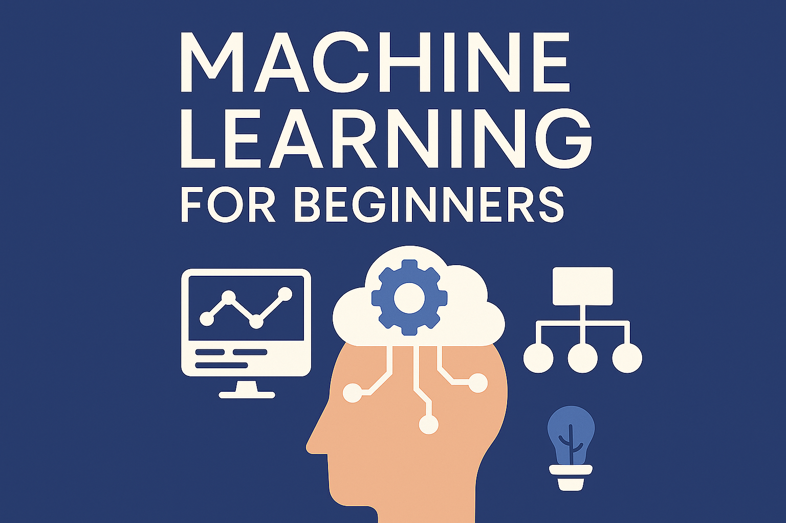 -->

# Machine Learning For Beginners

Embark on your Machine Learning journey with confidence! This repository is your comprehensive guide to understanding the fundamental concepts and the essential mathematics that power machine learning. Designed for absolute beginners, it demystifies complex topics, offering clear explanations, intuitive examples, and the underlying mathematical intuition you need to truly grasp how ML algorithms work. Whether you're an aspiring data scientist, a curious developer, or just someone eager to understand the buzz around AI, this resource will build a strong foundation for your future in Machine Learning."

---

## Table of Contents

* [1. Introduction to Machine Learning](#1-introduction-to-machine-learning)
    * [What is Machine Learning?](#what-is-machine-learning)
    * [Why Learn Machine Learning?](#why-learn-machine-learning)
    * [Types of Machine Learning](#types-of-machine-learning)
* [2. Prerequisites for Machine Learning](#2-prerequisites-for-machine-learning)
    * [Python Basics:](#python-basics)
    * [Fundamental Math Concepts (Overview):](#fundamental-math-concepts-overview)
    * [Recommended Libraries (for conceptual understanding, not necessarily coding yet):](#recommended-libraries-for-conceptual-understanding-not-necessarily-coding-yet)
* [3. Core Concepts in Machine Learning](#3-core-concepts-in-machine-learning)
    * [Data Fundamentals:](#data-fundamentals)
    * [Model Training & Evaluation:](#model-training--evaluation)
    * [Feature Engineering:](#feature-engineering)
    * [Optimization:](#optimization)
* [4. Mathematical Foundations for Machine Learning](#4-mathematical-foundations-for-machine-learning)
    * [4.1. Linear Algebra:](#41-linear-algebra)
    * [4.2. Calculus:](#42-calculus)
    * [4.3. Probability & Statistics:](#43-probability--statistics)
* [5. Supervised Learning Algorithms (Concepts & Math)](#5-supervised-learning-algorithms-concepts--math)
    * [5.1. Regression Algorithms:](#51-regression-algorithms)
    * [5.2. Classification Algorithms:](#52-classification-algorithms)
* [6. Unsupervised Learning Algorithms (Concepts & Math)](#6-unsupervised-learning-algorithms-concepts--math)
    * [6.1. Clustering Algorithms:](#61-clustering-algorithms)
    * [6.2. Dimensionality Reduction:](#62-dimensionality-reduction)
* [7. Model Selection & Improvement (Advanced Beginner Topics)](#7-model-selection--improvement-advanced-beginner-topics)
* [8. Next Steps & Further Learning](#8-next-steps--further-learning)
* [9. Contribution Guidelines](#9-contribution-guidelines)
* [10. License](#10-license)

---

## 1. Introduction to Machine Learning

Welcome to the exciting world of Machine Learning! This section lays the groundwork by defining what Machine Learning is, why it's so prevalent, and the main categories of ML systems you'll encounter.

### What is Machine Learning?

Machine Learning (ML) is a subset of Artificial Intelligence (AI) that empowers computers to **learn from data without being explicitly programmed**. Instead of writing specific instructions for every possible scenario, you feed an ML algorithm a vast amount of data, and it learns to identify patterns, make predictions, or make decisions based on those patterns.

The core idea here is to train a "model" using data. Once trained, this model can then make predictions or inferences on new, unseen data.

* Definition and Goals
    * **Definition:** Machine Learning is the study of computer algorithms that improve automatically through experience and by the use of data.
    * **Goals:**
        * **Prediction:** Forecasting future outcomes (e.g., predicting stock prices, house values).
        * **Classification:** Categorizing data into predefined classes (e.g., spam detection, image recognition).
        * **Clustering:** Grouping similar data points together (e.g., customer segmentation).
        * **Recommendation:** Suggesting items or content (e.g., Netflix recommendations).
        * **Anomaly Detection:** Identifying unusual patterns (e.g., fraud detection).

* AI vs. ML vs. Deep Learning (Brief Overview)
    * **Artificial Intelligence (AI):** The broader concept of machines executing tasks that require human-like intelligence (e.g., reasoning, problem-solving, understanding language). ML is a major subfield of AI.
    * **Machine Learning (ML):** As defined above, focuses on systems that learn from data. All ML is AI, but not all AI is ML.
    * **Deep Learning (DL):** A specialized subfield of ML that uses artificial neural networks with multiple layers (hence "deep") to learn complex patterns. DL has revolutionized fields like computer vision and natural language processing. All DL is ML, but not all ML is DL.

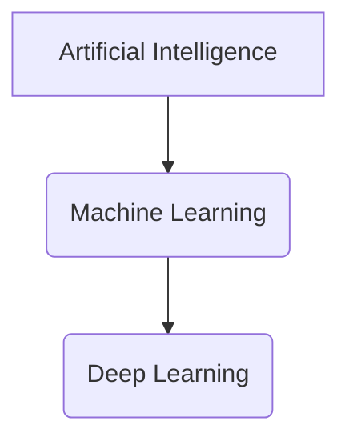

### Why Learn Machine Learning?

Machine Learning isn't just a buzzword; it's a transformative technology impacting nearly every industry and aspect of our lives. Understanding ML is becoming an essential skill in our data-driven world.

* Applications and Impact (Real-world examples)
    - **Healthcare:** Disease diagnosis, drug discovery, personalized treatment plans.
    - **Finance:** Fraud detection, algorithmic trading, credit scoring.
    - **E-commerce:** Product recommendations, targeted advertising, inventory management.
    - **Transportation:** Self-driving cars, traffic prediction.
    - **Customer Service:** Chatbots, sentiment analysis.
    - **Entertainment:** Content recommendations (Netflix, Spotify), video game AI.
    - **Security:** Facial recognition, cybersecurity threat detection.
    - **Science:** Climate modeling, material science, genomics.

### Types of Machine Learning

Machine learning problems are broadly categorized based on the nature of the training data and the task the algorithm is designed to perform.

* **Supervised Learning**
    - **Definition:** The algorithm learns from **labeled data**, meaning each training example includes both the input features and the correct output (label). The goal is to learn a mapping from inputs to outputs so that the model can predict outputs for new, unseen inputs.
    - **Analogy:** Learning with a teacher who provides correct answers.
    - **Common Tasks:**
        - **Regression:** Predicting a continuous numerical value (e.g., house price, temperature).
        - **Classification:** Predicting a discrete category or class (e.g., spam/not-spam, disease/no-disease).
    - **Examples:** Image classification (cat/dog), spam detection, predicting house prices, credit risk assessment.

* **Unsupervised Learning**

    - **Definition:** The algorithm learns from **unlabeled data**, where only input features are provided without any corresponding output labels. The goal is to find hidden patterns, structures, or relationships within the data.
    - **Analogy:** Learning without a teacher, discovering patterns on your own.
    - **Common Tasks:**
        - **Clustering:** Grouping similar data points together (e.g., customer segmentation, gene clustering).
        - **Dimensionality Reduction:** Reducing the number of features in a dataset while retaining most of the important information (e.g., for visualization, noise reduction).
        - **Association Rule Mining:** Discovering relationships between variables in large datasets (e.g., "customers who buy X also buy Y").
    - **Examples:** Market segmentation, anomaly detection, topic modeling in documents.

* **Reinforcement Learning (Brief Introduction)**

    - **Definition:** An agent learns to make decisions by performing actions in an environment to maximize a cumulative reward. It learns through trial and error, getting positive or negative feedback for its actions.
    - **Analogy:** Training a pet with rewards.
    - **Examples:** Game AI (AlphaGo), robotics, autonomous driving.

* **Semi-supervised Learning (Brief Introduction)**

    - **Definition:** Uses a combination of a small amount of labeled data and a large amount of unlabeled data during training. It can be useful when obtaining labeled data is expensive or time-consuming.
    - **Example:** Image classification where only a few images are manually tagged, and the algorithm uses unlabeled images to improve its understanding.

---

## 2. Prerequisites for Machine Learning

Before diving deep into the fascinating world of Machine Learning, having a foundational understanding of a few key areas will significantly enhance your learning experience.

### Python Basics:

Python is the lingua franca of Machine Learning due to its simplicity, vast ecosystem of libraries, and strong community support. A basic grasp of these Python concepts is essential:

- **Variables, Data Types (Lists, Tuples, Dictionaries):** Understanding how to store and manipulate different types of data.
- **Control Flow (If/Else, Loops):** How to write conditional logic and iterate over data.
- **Functions:** Defining reusable blocks of code.
- **Object-Oriented Programming (Basic concepts for classes/objects):** While not strictly necessary for every ML script, understanding basic OOP concepts (like what an object is and how to use methods) will be helpful when working with ML libraries like Scikit-learn, which are built using OOP principles.

### Fundamental Math Concepts (Overview):

Don't let the word "math" intimidate you! For beginners, the focus isn't on proving theorems but on understanding the intuition behind the concepts and how they apply to ML. This repository will delve into the _math behind it_ in subsequent sections, but a high-level familiarity helps:

- **Algebra (Equations, Functions):** The backbone of representing relationships between variables.
- **Basic Calculus (Derivatives - intuition for optimization):** Understanding the concept of a derivative as a "rate of change" or "slope." This intuition is vital for grasping how ML models "learn" by minimizing errors (optimization).
- **Basic Linear Algebra (Vectors, Matrices, Dot Products - intuition for data representation):** Knowing what vectors and matrices are, and how they represent data in a structured way (e.g., a dataset is a matrix, a single data point is a vector). The dot product is fundamental for many operations.
- **Basic Probability & Statistics (Mean, Median, Mode, Variance, Standard Deviation, Distributions):** These concepts help in understanding data characteristics, dealing with uncertainty, and evaluating model performance.

### Recommended Libraries (for conceptual understanding, not necessarily coding yet):

While we'll focus on the concepts and math, you'll inevitably interact with these Python libraries in any practical ML endeavor. Familiarizing yourself with their purpose will be beneficial:

- **NumPy:** The fundamental package for numerical computing in Python. It provides powerful array objects and tools for working with them efficiently. All other scientific libraries often build upon NumPy arrays.
- **Pandas:** An essential library for data manipulation and analysis. It introduces DataFrames, which are tabular data structures (like spreadsheets) that make working with structured data intuitive and efficient.
- **Matplotlib/Seaborn:** Libraries for creating static, interactive, and animated visualizations in Python. Visualizing data and model results is a crucial part of the ML workflow.

---

## 3. Core Concepts in Machine Learning

This section introduces the foundational concepts that underpin almost all machine learning processes. Understanding these ideas is crucial before diving into specific algorithms, as they form the common language and principles used throughout the field.

### Data Fundamentals:

At the heart of machine learning is data. How data is structured, characterized, and prepared directly impacts the performance of your models.

-   **Types of Data:**
    -   **Numerical Data:** Represents quantities and can be measured.
        -   **Continuous:** Can take any value within a range (e.g., temperature, height, price).
        -   **Discrete:** Can only take specific, distinct values, often integers (e.g., number of children, counts).
    -   **Categorical Data:** Represents categories or groups.
        -   **Nominal:** Categories with no inherent order (e.g., colors - red, blue, green; marital status).
        -   **Ordinal:** Categories with a meaningful order (e.g., education level - high school, bachelor's, master's; rating - low, medium, high).

-   **Features and Labels (Independent vs. Dependent Variables):**
    -   **Features (Independent Variables / Inputs):** The individual measurable properties or characteristics of the phenomenon being observed. These are the pieces of information your model uses to make predictions. In a dataset, these are typically the columns that describe each instance.
    -   **Labels (Dependent Variables / Outputs / Targets):** The variable that you are trying to predict or explain. For supervised learning, this is the "answer" provided in the training data.
    -   **Example:** In predicting house prices: "Number of bedrooms," "Square footage," "Location" are **features**, and "House price" is the **label**.

-   **Datasets (Training, Validation, Test Sets):**
    -   To build robust ML models, datasets are typically split into three parts:
        -   **Training Set:** The largest portion of the data, used to train the machine learning model. The model learns patterns from this data.
        -   **Validation Set (or Development Set):** Used to tune the model's hyperparameters and to provide an unbiased evaluation of a model _while tuning model hyperparameters_. It helps in preventing overfitting to the training data.
        -   **Test Set:** A completely unseen portion of the data, used _only once_ at the very end to provide a final, unbiased evaluation of the model's performance. It gives an estimate of how the model will perform on real-world, new data.

-   **Data Quality (Missing Values, Outliers):**
    -   **Missing Values:** Data points that are not recorded for a feature. These need to be handled (e.g., by imputation or removal) as most ML algorithms cannot work with missing data.
    -   **Outliers:** Data points that significantly deviate from other observations. Outliers can skew model training and lead to inaccurate results if not handled appropriately.

### Model Training & Evaluation:

This describes the core process of building and assessing an ML model.

-   **What is a Model?**
    
    -   In machine learning, a "model" is the output of the training process. It's a mathematical function or a set of rules that has learned patterns from the training data. The model can then be used to make predictions or decisions on new data.

-   **Training a Model:**
    
    -   The process of feeding data to a machine learning algorithm so that it can learn the relationships and patterns within that data. During training, the model's internal parameters are adjusted iteratively to minimize a defined error.

-   **Prediction/Inference:**
    
    -   Once a model is trained, **prediction** (or **inference**) is the process of using the trained model to make an output for new, unseen input data.

-   **Underfitting vs. Overfitting:**
    
    -   **Underfitting:** Occurs when a model is too simple to capture the underlying patterns in the training data. It performs poorly on both training and test data, indicating that it hasn't learned enough.
    -   **Overfitting:** Occurs when a model learns the training data _too well_, including noise and irrelevant details. It performs excellently on the training data but poorly on unseen test data, as it fails to generalize.
    -   **Bias-Variance Tradeoff (Mathematical Intuition):**
        -   This is a central concept in understanding model performance.
        -   **Bias:**  The error introduced by approximating a real-world problem, which may be complex, by a simplified model. High bias leads to underfitting.
        -   **Variance:** The amount that the estimate of the target function will change if different training data was used. High variance leads to overfitting.
        -   **Tradeoff:** There's an inverse relationship between bias and variance. Reducing one often increases the other. The goal is to find a balance that minimizes the total error (Bias^2 + Variance + Irreducible Error).

            

            $$Total Error = Bias^2 + Variance + Irreducible Error$$
            

* **Model Evaluation Metrics (General Overview for now, detailed later):**
  * After training, we need to assess how well our model performs. Different metrics are used depending on the type of problem (regression vs. classification).

  * **For Regression:**

    * **Mean Squared Error (MSE):** Average of the squared differences between predicted and actual values. Penalizes larger errors more.

      

      $$\text{MSE} = \frac{1}{N} \sum_{i=1}^{N} (y_i - \hat{y}_i)^2$$
      

      * **N**: The total number of data points or observations.
      * **$Y_i$**: The actual or observed value for the _i_-th data point.
      * **$\hat{Y}_i$**: The predicted value for the _i_-th data point, as generated by the model.
      * **$(Y_i - \hat{Y}_i)$**: This is the error (or residual) for the _i_-th prediction. It represents the difference between the actual value and the predicted value.
      * **$(Y_i - \hat{Y}_i)^2$**: The error for each prediction is squared. This has two important consequences:
        1. **Positive Values:** Squaring ensures that all error terms are positive. This prevents negative and positive errors from canceling each other out.
        2. **Penalizing Larger Errors:** Squaring gives a higher weight to larger errors. A large discrepancy between the actual and predicted value will result in a significantly larger squared error than a small discrepancy.
      * **$\sum_{i=1}^{N}$**: This is the summation symbol, indicating that the squared errors for all _N_ data points are added together.
      * **$\frac{1}{N}$**: The sum of the squared errors is then divided by the number of data points to get the average or mean.

    * **Mean Absolute Error (MAE):** Average of the absolute differences between predicted and actual values. Less sensitive to outliers than MSE.

      

      $$\text{MAE} = \frac{1}{N} \sum_{i=1}^{N} |y_i - \hat{y}_i|$$
      

      * **N**: The total number of data points or observations.
      * **$Y_i$**: The actual or observed value for the _i_-th data point.
      * **$\hat{Y}_i$**: The predicted value for the _i_-th data point, as generated by the model.
      * **$|Y_i - \hat{Y}_i|$**: This is the error (or residual) for the _i_-th prediction. It represents the absolute difference between the actual value and the predicted value.
      * **$\sum_{i=1}^{N}$**: This is the summation symbol, indicating that the squared errors for all _N_ data points are added together.
      * **$\frac{1}{N}$**: The sum of the absolute errors is then divided by the number of data points to get the average or mean.

    * **R-squared (R2):** **R-squared error**, more commonly known as $R^2$ **(R-squared)** or the **coefficient of determination** is a statistical measure used to evaluate the **goodness of fit** of a regression model. It tells us how much of the **variance in the dependent variable (target)** is **explained by the independent variable(s)** in the model.

      

      $$R^2 = 1 - \frac{SS_{res}}{SS_{total}}$$
      

      * $SS_{res}:$ Residual sum of squares = $∑(yᵢ - ŷᵢ)²$
      * $SS_{tot}:$ Total sum of squares = $∑(yᵢ - ȳ)²$
      * $yᵢ:$ Actual value
      * $ŷᵢ:$ Predicted value
      * $ȳ:$ Mean of actual values

    * **For Classification:**

      * **Accuracy:** The proportion of correctly predicted instances out of the total instances. (Can be misleading with imbalanced datasets).
      * **Precision:** The proportion of correctly predicted positive observations out of all predicted positives. "Of all the times we predicted positive, how many were actually positive?"
      * **Recall (Sensitivity):** The proportion of correctly predicted positive observations out of all actual positives. "Of all the actual positives, how many did we correctly identify?"
      * **F1-Score:** The harmonic mean of Precision and Recall. Useful when you need a balance between Precision and Recall.
      * **Confusion Matrix:** A table that summarizes the performance of a classification model, showing True Positives, True Negatives, False Positives, and False Negatives. (Will be detailed in classification algorithms).

### Feature Engineering:

The process of creating new features or transforming existing ones from raw data to improve the performance of machine learning models. It's often more impactful than algorithm tuning.

-   **Definition and Importance:**
    -   **Definition:** The art of creating new input features from existing ones that are more informative and useful for your machine learning model.
    -   **Importance:** Well-engineered features can significantly boost model accuracy, even with simpler algorithms, by allowing the model to better understand the underlying patterns.
-   **Common Techniques:**
    -   **One-hot encoding:** Converting categorical variables into a numerical format that ML algorithms can understand without implying an artificial order. For a feature with N categories, it creates N new binary features.
    -   **Scaling:** Adjusting the range of feature values.
        -   **Standardization (Z-score normalization):** Rescales data to have a mean (μ) of 0 and a standard deviation (σ) of 1.

            

            $$z = \frac{x - \mu}{\sigma}$$
            

        -   **Normalization (Min-Max scaling):** Rescales data to a fixed range, usually between 0 and 1.

            

            $$x_{scaled} = \frac{x - x_{min}}{x_{max} - x_{min}}$$
            

        -   **Why Scale?** Many ML algorithms (like Gradient Descent, KNN, SVM) are sensitive to the scale of input features because they involve distance calculations or weight updates. Scaling prevents features with larger ranges from dominating the learning process.

### Optimization:

It is the process of finding the best set of model parameters that minimize the model's error (cost/loss).

-   **Cost/Loss Functions (What they are, why we use them):**
    -   **Definition:** A function that quantifies the "error" or "cost" associated with a model's predictions. The lower the cost, the better the model's performance.
    -   **Why use them?** They provide a measurable objective that the ML algorithm tries to minimize during training, guiding the learning process. Different ML tasks (e.g., regression vs. classification) use different types of cost functions.

-   **Gradient Descent (Intuition and basic math for univariate):**
    -   **Definition:** An iterative optimization algorithm used to find the minimum of a function (our cost function). It works by taking small steps in the direction of the steepest decrease of the function.
    -   **Intuition:** Imagine you are blindfolded on a mountain and want to reach the lowest point. You'd feel the slope around you and take a small step downhill in the steepest direction. You repeat this until you can't go down further.
    -   **Learning Rate (α):**
        -   A crucial hyperparameter in Gradient Descent. It controls the size of the steps taken towards the minimum.
        -   Too large α: May overshoot the minimum or even diverge.
        -   Too small α: Training will be very slow and may get stuck in local minima.
    -   **Batch vs. Stochastic vs. Mini-batch Gradient Descent:** These are variations of Gradient Descent differing in how much data they use to compute the gradient at each step.
        -   **Batch Gradient Descent:** Uses the entire training dataset to compute the gradient for each step. Can be slow for large datasets but guarantees convergence to a minimum.
        -   **Stochastic Gradient Descent (SGD):** Uses only one randomly chosen training example at each step to compute the gradient. Faster but with more noisy updates, leading to oscillations around the minimum.
        -   **Mini-batch Gradient Descent:** A compromise between Batch and SGD. Uses a small random subset (mini-batch) of the training data at each step. This offers a good balance of speed and stability.

---

## 4. Mathematical Foundations for Machine Learning

While Machine Learning often feels like coding, at its core, it's deeply rooted in mathematics. A solid grasp of these mathematical fundamentals isn't about memorizing complex proofs, but about building intuition for *why* algorithms work the way they do and understanding their limitations. This section will lay out the essential concepts from Linear Algebra, Calculus, and Probability & Statistics.

### 4.1. Linear Algebra:

Linear Algebra is the mathematics of vectors, matrices, and linear transformations. It's the language used to represent data, features, and model parameters in machine learning, making it fundamental for almost every algorithm.

* **Scalars, Vectors, Matrices (Definitions and Basic Operations):**

  * **Scalar:** A single number (e.g., 5, -2.7, $\pi$).

  * **Vector:** An ordered list of numbers. Can represent a point in space, a direction, or a single data instance's features.

    * **Row Vector:** 

    * **Column Vector:** 

    

      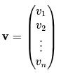
    

  * **Matrix:** A rectangular array of numbers arranged in rows and columns. Datasets are often represented as matrices, where rows are data points and columns are features.

    

      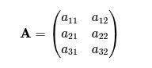
    

* **Vector Addition and Scalar Multiplication:**

  * **Vector Addition:** Adding two vectors of the same dimension, element-wise.

    

      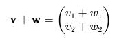
    

  * **Scalar Multiplication:** Multiplying a vector (or matrix) by a scalar, element-wise.

    

      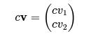
    

* **Dot Product (Vector Multiplication):**

  * A fundamental operation that takes two vectors and returns a single scalar. It measures the extent to which two vectors point in the same direction. Crucial for calculating similarity, projections, and weighted sums (e.g., in linear regression or neural networks).

  * For:  
    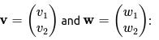

    

      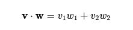
    

  * In general for $n$ dimensions:

    

      $$\mathbf{v} \cdot \mathbf{w} = \sum_{i=1}^{n} v_i w_i$$
    

* **Matrix Multiplication (Conceptual and Rule-based):**

  * Multiplies two matrices to produce a third matrix. It's not element-wise multiplication. The number of columns in the first matrix must equal the number of rows in the second.

  * Conceptual: Each element in the resulting matrix is the dot product of a row from the first matrix and a column from the second matrix.

  * Importance: Used extensively in neural networks (layer transformations), transformations in PCA, and solving systems of linear equations.

* **Transposition:**

  * Flipping a matrix over its diagonal, converting rows into columns and columns into rows. Denoted by a superscript $T$.

  * If:

    

      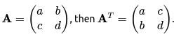
    

* **Identity Matrix:**

  * A square matrix with ones on the main diagonal and zeros elsewhere. Denoted by $\mathbf{I}$. When multiplied by another matrix, it leaves the other matrix unchanged.

* **Inverse Matrix (Brief mention):**

  * For a square matrix $\mathbf{A}$, its inverse $\mathbf{A}^{-1}$ is a matrix such that $\mathbf{A} \mathbf{A}^{-1} = \mathbf{I}$. Used in analytical solutions for linear regression (Normal Equation).

* **Why Linear Algebra is crucial in ML:**

  * **Data Representation:** Datasets are represented as matrices. Individual data points are vectors.

  * **Feature Transformations:** Many preprocessing steps (like scaling, PCA) involve matrix operations.

  * **Model Parameters:** Weights and biases in models (e.g., linear regression, neural networks) are often vectors or matrices.

  * **Algorithm Operations:** Core operations of many algorithms (e.g., dot products for predictions, matrix multiplications in neural networks) are linear algebraic.

### 4.2. Calculus:

Calculus is the study of change. In Machine Learning, it's primarily used for **optimization** – finding the best possible parameters for a model by minimizing a cost function.

* **Functions and Graphs:**
    * Understanding what a function represents (input-output relationship) and how to visualize it on a graph. The cost function $J(\theta)$ is a function we want to minimize.
* **Limits (Intuition):**
    * The concept of approaching a value without necessarily reaching it. Forms the foundation for derivatives.
* **Derivatives (Rate of Change, Slope of a Tangent):**
    * **Definition:** The derivative of a function measures how sensitive the output of the function is to changes in its input. Geometrically, it's the slope of the tangent line to the function's graph at a given point.
    * **Intuition:** If you're walking on a curve, the derivative tells you how steep the path is at your current location and in which direction (uphill/downhill).
    * **Rules of Differentiation (Power Rule, Chain Rule - focus on application):**
        * **Power Rule:** If $f(x) = x^n$, then $f'(x) = nx^{n-1}$.
        * **Chain Rule:** Used for differentiating composite functions. If $h(x) = f(g(x))$, then $h'(x) = f'(g(x)) \cdot g'(x)$. This is crucial for backpropagation in neural networks.
    * **Partial Derivatives (Introduction for multi-variable functions):**
        * When a function has multiple input variables (e.g., a cost function depending on many weights), a partial derivative measures the rate of change with respect to *one* variable, holding all others constant.
        * Example: For $f(x, y) = x^2 + y^3$, the partial derivative with respect to $x$ is $\frac{\partial f}{\partial x} = 2x$.
* **Gradients (Vector of partial derivatives):**
    * For a function with multiple variables, the gradient is a vector containing all its partial derivatives. It points in the direction of the steepest ascent of the function.
    * The gradient of $J(\theta_0, \theta_1)$ is:

    

      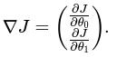
    

* **Minima and Maxima (How derivatives help find them):**
    * At local minima or maxima of a function, the derivative (or gradient for multi-variable functions) is zero. This is why Gradient Descent aims to reach a point where the gradient is zero or very close to zero.
* **Why Calculus is crucial in ML:**
    * **Optimization (Gradient Descent):** Derivatives are the backbone of Gradient Descent, telling us which direction to adjust model parameters to reduce the cost.
    * **Backpropagation:** The algorithm for training neural networks relies heavily on the chain rule for calculating gradients.
    * **Loss Functions:** Many loss functions are designed to be differentiable, enabling gradient-based optimization.

### 4.3. Probability & Statistics:

Probability deals with the likelihood of events, and statistics deals with collecting, analyzing, interpreting, and presenting data. Both are critical for understanding data, making informed decisions, and evaluating the uncertainty in machine learning models.

* **4.3.1. Basic Statistics:**
    * **Mean, Median, Mode:** Measures of central tendency.
        * **Mean ($\mu$):** The average. $\mu = \frac{1}{N} \sum_{i=1}^{N} x_i$
        * **Median:** The middle value when data is ordered.
        * **Mode:** The most frequent value.
    * **Variance ($\sigma^2$) and Standard Deviation ($\sigma$):** Measures of data spread or dispersion.
        * **Variance:** Average of the squared differences from the mean. $\sigma^2 = \frac{1}{N} \sum_{i=1}^{N} (x_i - \mu)^2$
        * **Standard Deviation:** Square root of the variance. Provides a measure of spread in the same units as the data. $\sigma = \sqrt{\frac{1}{N} \sum_{i=1}^{N} (x_i - \mu)^2}$
    * **Percentiles and Quartiles:** Describe the position of a value relative to the rest of the data.
    * **Covariance and Correlation (Intuition):**
        * **Covariance:** Measures the joint variability of two random variables. Indicates if they tend to increase or decrease together.
        * **Correlation:** A normalized version of covariance, ranging from -1 to 1. Describes the strength and direction of a linear relationship between two variables.

* **4.3.2. Probability Theory:**
    * **Events, Sample Space:**
        * **Sample Space ($\Omega$):** The set of all possible outcomes of an experiment.
        * **Event:** A subset of the sample space.
    * **Probability of an Event (P(A)):** The likelihood of an event occurring, between 0 and 1.
    * **Conditional Probability (P(A|B)):** The probability of event A occurring, given that event B has already occurred.
        
        

          $$P(A|B) = \frac{P(A \cap B)}{P(B)}$$
        

  
    * **Independent and Dependent Events:**
        * **Independent:** The occurrence of one event does not affect the probability of the other. $P(A \cap B) = P(A)P(B)$.
        * **Dependent:** The occurrence of one event influences the probability of the other.
    * **Bayes' Theorem (Conceptual introduction - for Naive Bayes):**
        * A fundamental theorem that describes how to update the probability of a hypothesis based on new evidence. Crucial for probabilistic models like Naive Bayes.

        

          $$P(H|E) = \frac{P(E|H) P(H)}{P(E)}$$
        

        * *Where P(H|E) is the posterior probability, P(E|H) is the likelihood, P(H) is the prior probability, and P(E) is the evidence.

* **4.3.3. Probability Distributions:**
    * **Normal (Gaussian) Distribution:**
        * A very common and important continuous probability distribution, characterized by its bell-shaped curve. Many natural phenomena and statistical samples approximate this distribution. Defined by its mean ($\mu$) and standard deviation ($\sigma$).
    * **Binomial Distribution (Brief mention)**:
        * A discrete probability distribution that models the number of successes in a fixed number of independent Bernoulli trials (e.g., coin flips).

* **4.3.4. Why Probability & Statistics are crucial in ML:**
    * **Understanding Data:** Descriptive statistics help summarize and understand the properties of your dataset.
    * **Model Assumptions:** Many ML algorithms (e.g., Linear Regression, Naive Bayes) make assumptions about the underlying distribution of data.
    * **Uncertainty and Confidence:** Statistical methods allow us to quantify the uncertainty in our predictions and build confidence intervals.
    * **Model Evaluation:** Metrics like p-values, confidence intervals, and hypothesis testing (though less common for daily ML practice, they form the bedrock) are rooted in statistics.
    * **Generative Models:** Probabilistic models explicitly model the underlying data distribution.

---

## 5. Supervised Learning Algorithms (Concepts & Math)

Supervised learning is the most common type of machine learning problem. In supervised learning, the model learns from a dataset that includes **labeled examples**, meaning each data point comes with both input features and the corresponding correct output (the "label" or "target"). The goal is for the model to learn a mapping from features to labels so it can accurately predict outputs for new, unseen data.

Supervised learning problems are broadly categorized into:
* **Regression:** Predicting a continuous numerical value.
* **Classification:** Predicting a discrete category or class.

---

### 5.1. Regression Algorithms:

Regression algorithms are used when the target variable is a continuous numerical value. The model learns to predict this value based on the input features.

---

#### **Linear Regression:**

Linear Regression is one of the simplest and most fundamental algorithms in machine learning. It models the relationship between a dependent variable (label) and one or more independent variables (features) by fitting a linear equation to the observed data.

* **Simple Linear Regression (Equation, Assumptions):**
  * **Equation:** For a single feature $x$, the relationship is modeled as a straight line:

      

        $$h_\theta(x) = \theta_0 + \theta_1 x$$
      

    Where:
    * $h_\theta(x)$ (or $\hat{y}$) is the predicted output.
    * $\theta_0$ (theta-zero) is the y-intercept (the value of $y$ when $x=0$).
    * $\theta_1$ (theta-one) is the slope of the line (how much $y$ changes for a unit change in $x$).
    * $x$ is the input feature.

  * **Assumptions (Key ones for valid inference, less strict for pure prediction):**
    * **Linearity:** The relationship between features and the target is linear.
    * **Independence:** Observations are independent of each other.
    * **Homoscedasticity:** The variance of the residuals (errors) is constant across all levels of the independent variables.
    * **Normality of Residuals:** Residuals are normally distributed.
    * **No or Little Multicollinearity:** Independent variables are not highly correlated with each other.

* **Multiple Linear Regression:**
    * Extends simple linear regression to include multiple features. The equation becomes:

        

            $$h_\theta(\mathbf{x}) = \theta_0 + \theta_1 x_1 + \theta_2 x_2 + \dots + \theta_n x_n$$
        

        In a more compact **vectorized form**, where $\mathbf{x}$ is a vector of features (with $x_0=1$ for the intercept term) and $\theta$ is a vector of parameters:

        

            $$h_\theta(\mathbf{x}) = \theta^T \mathbf{x}$$
        

* **Cost Function (Mean Squared Error - MSE):**
    * To find the "best" line, we need to define what "best" means. This is done by a **Cost Function**, which measures the difference between our model's predictions and the actual target values. For Linear Regression, the **Mean Squared Error (MSE)** is commonly used. Our goal is to find the values of $\theta$ that minimize this cost.
    * The cost function $J(\theta)$ for $m$ training examples is:

        

            $$J(\theta) = \frac{1}{2m} \sum_{i=1}^{m} (h_\theta(x^{(i)}) - y^{(i)})^2$$
        

        Where:
        * $m$ is the number of training examples.
        * $h_\theta(x^{(i)})$ is the model's prediction for the $i$-th training example.
        * $y^{(i)}$ is the actual target value for the $i$-th training example.

* **Gradient Descent for Linear Regression (Derivations & Update Rules):**
    * **Gradient Descent** is an iterative optimization algorithm used to find the values of $\theta$ (parameters) that minimize the cost function $J(\theta)$. It repeatedly adjusts the parameters in the direction opposite to the gradient of the cost function.
    * The **update rule** for each parameter $\theta_j$ is:

        

            $$\theta_j := \theta_j - \alpha \frac{\partial}{\partial \theta_j} J(\theta)$$
        

        Where:
        * $\alpha$ (alpha) is the **learning rate**, a hyperparameter that controls the step size of each update.
        * $\frac{\partial}{\partial \theta_j} J(\theta)$ is the partial derivative of the cost function with respect to parameter $\theta_j$. This derivative tells us the slope (gradient) of the cost function with respect to that parameter.

    * **Partial Derivatives for Linear Regression Cost Function:**
        * For $\theta_0$ (intercept):

        

            $$\frac{\partial}{\partial \theta_0} J(\theta) = \frac{1}{m} \sum_{i=1}^{m} (h_\theta(x^{(i)}) - y^{(i)})$$
        

        * For $\theta_j$ (for $j=1, \dots, n$ features):
        
        

            $$\frac{\partial}{\partial \theta_j} J(\theta) = \frac{1}{m} \sum_{i=1}^{m} (h_\theta(x^{(i)}) - y^{(i)}) x_j^{(i)}$$
        

* **Normal Equation (Alternative for analytical solution):**
    * For linear regression, there's a closed-form solution to find the optimal $\theta$ values without iteration. This is called the **Normal Equation**.

        

            $$\theta = (X^T X)^{-1} X^T \mathbf{y}$$
        

    
        Where:
        * $\theta$ is the vector of optimal parameters.
        * $X$ is the design matrix (matrix of features, with a column of ones for the intercept).
        * $X^T$ is the transpose of $X$.
        * $(X^T X)^{-1}$ is the inverse of the matrix $(X^T X)$.
        * $\mathbf{y}$ is the vector of actual target values.
    * **Pros:** No need to choose a learning rate $\alpha$, no iteration.
    * **Cons:** Computationally expensive for very large datasets as it requires calculating a matrix inverse, which scales poorly with the number of features ($O(n^3)$ complexity). Gradient Descent is preferred for large datasets or many features.

* **Evaluation Metrics (Revisit from Section 3, now in context):**
    * **Mean Squared Error (MSE):** Already discussed as the cost function.
        
        

            $$\text{MSE} = \frac{1}{N} \sum_{i=1}^{N} (y_i - \hat{y}_i)^2$$
        

    
    * **Mean Absolute Error (MAE):**
        
        

            $$MAE = \frac{1}{N} \sum_{i=1}^{N} |y_i - \hat{y}_i|$$
        

    
    * **R-squared ($R^2$):** Also known as the coefficient of determination. It measures the proportion of the variance in the dependent variable that can be explained by the independent variables. Values range from 0 to 1, with 1 indicating a perfect fit.

        

            $$R^2 = 1 - \frac{\sum_{i=1}^{N} (y_i - \hat{y}_i)^2}{\sum_{i=1}^{N} (y_i - \bar{y})^2}$$
        

        * The numerator is the sum of squared residuals (SSR) and the denominator is the total sum of squares (SST).

---

#### 5.1.2. Polynomial Regression (Brief overview, transformation of linear regression)

* **Concept:** Polynomial Regression is a form of linear regression where the relationship between the independent variable $x$ and the dependent variable $y$ is modeled as an $n$-th degree polynomial. It's still considered "linear" because it's linear in terms of its parameters ($\theta$).
* **Equation (Example for degree 2):**
    
    

        $$h_\theta(x) = \theta_0 + \theta_1 x + \theta_2 x^2$$
    

    
    * You effectively create new features by taking powers of the original features. Once these polynomial features are created, the model is trained using the same linear regression techniques (e.g., Gradient Descent or Normal Equation).

---

### 5.2. Classification Algorithms:

Classification algorithms are used when the target variable is a discrete category or class. The model learns to assign new data points to one of these predefined categories.

---

#### 5.2.1. Logistic Regression

Despite its name, Logistic Regression is a fundamental **classification algorithm**, not a regression algorithm. It's used for predicting the probability that an instance belongs to a particular class (e.g., 0 or 1, true or false).

* **Binary Classification (Sigmoid Function):**
  
  * For binary classification, Logistic Regression uses the **Sigmoid function** (also called the Logistic function) to squash the output of a linear equation into a probability between 0 and 1.
  
  * The linear part is: $z = \theta^T \mathbf{x}$
  
  * The Sigmoid function $\sigma(z)$ is:
    
    

      $$\sigma(z) = \frac{1}{1 + e^{-z}}$$
    

  * The predicted probability $\hat{p}$ for class 1 is:

    

      $$\hat{p} = h_\theta(\mathbf{x}) = \sigma(\theta^T \mathbf{x})$$
    

  * If $\hat{p} \geq 0.5$, classify as 1 (positive class); otherwise, classify as 0 (negative class).

* **Multi-class Classification (Softmax - Brief):**

  * For problems with more than two classes, Logistic Regression can be extended using the **Softmax function** (also known as multinomial logistic regression). Softmax outputs a probability distribution over multiple classes, ensuring the probabilities sum to 1.

* **Cost Function (Cross-Entropy/Log Loss):**

  * Instead of MSE, Logistic Regression uses a cost function called **Log Loss** or **Binary Cross-Entropy**. This cost function penalizes confident wrong predictions heavily and is convex for Logistic Regression, allowing Gradient Descent to find the global minimum.

  * For a single training example $(x^{(i)}, y^{(i)})$ where $y^{(i)} \in \{0, 1\}$:

    

      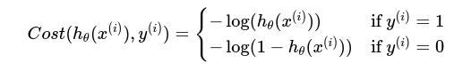
    

  * The overall cost function $J(\theta)$ for $m$ training examples is the average of these costs:
    
    

      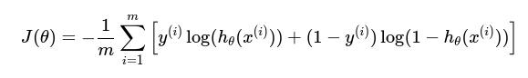
    

* **Gradient Descent for Logistic Regression (Derivations & Update Rules):**

  * Similar to linear regression, Gradient Descent is used to minimize the cross-entropy cost function.
  
  * The **update rule** for each parameter $\theta_j$ is still:

    

      $$\theta_j := \theta_j - \alpha \frac{\partial}{\partial \theta_j} J(\theta)$$
    

  * Interestingly, the partial derivative for Logistic Regression takes a very similar form to Linear Regression, despite the different cost function:

    

      $$\frac{\partial}{\partial \theta_j} J(\theta) = \frac{1}{m} \sum_{i=1}^{m} (h_\theta(x^{(i)}) - y^{(i)}) x_j^{(i)}$$
    

* **Decision Boundary:**

  * Logistic Regression creates a **linear decision boundary** in the feature space. This is a line (or hyperplane in higher dimensions) that separates the different classes. Instances falling on one side of the boundary are classified into one class, and instances on the other side into the other class.

* **Evaluation Metrics (Specific to Classification):**
  
  * **Confusion Matrix:** A table that summarizes the performance of a classification model. It shows the number of:
    * **True Positives (TP):** Correctly predicted positive cases.
    * **True Negatives (TN):** Correctly predicted negative cases.
    * **False Positives (FP) / Type I Error:** Incorrectly predicted positive cases (model predicted positive, but actual was negative).
    * **False Negatives (FN) / Type II Error:** Incorrectly predicted negative cases (model predicted negative, but actual was positive).

    

      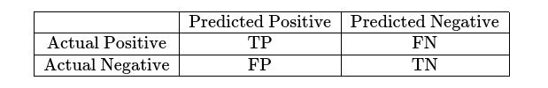
    

  * **Accuracy:** Overall correctness.

    

      $$\text{Accuracy} = \frac{TP + TN}{TP + TN + FP + FN}$$
    

    * *Limitations:* Can be misleading with imbalanced datasets. If 95% of emails are not spam, a model that always predicts "not spam" will have 95% accuracy but be useless.
    
  * **Precision:** Of all positive predictions, how many were correct?

    

      $$\text{Precision} = \frac{TP}{TP + FP}$$
    

    * *High precision is important when false positives are costly (e.g., medical diagnosis, spam filter).*

  * **Recall (Sensitivity):** Of all actual positive cases, how many were correctly identified?

    

      $$\text{Recall} = \frac{TP}{TP + FN}$$
    

    * *High recall is important when false negatives are costly (e.g., fraud detection, finding all sick patients).*

  * **F1-Score:** The harmonic mean of Precision and Recall. Provides a single score that balances both. Useful for imbalanced datasets.

    

      $$\text{F1-Score} = 2 \times \frac{\text{Precision} \times \text{Recall}}{\text{Precision} + \text{Recall}}$$
    

  * **ROC Curve and AUC (Conceptual):**

    * **Receiver Operating Characteristic (ROC) Curve:** A plot that illustrates the diagnostic ability of a binary classifier system as its discrimination threshold is varied. It plots the True Positive Rate (Recall) against the False Positive Rate (1 - Specificity).

    * **Area Under the Curve (AUC):** The area under the ROC curve. It provides a single number summary of the classifier's performance across all possible classification thresholds. An AUC of 1.0 means a perfect classifier, while 0.5 means it's no better than random guessing.

---

#### 5.2.2. K-Nearest Neighbors (KNN)

KNN is a simple, non-parametric, lazy learning algorithm used for both classification and regression.

* **How it works (Distance metric - Euclidean):**
    1.  **"Lazy" Learning:** It doesn't learn a discriminative function from the training data, but simply memorizes the training dataset.
    2.  **Prediction:** To classify a new, unseen data point:
        * Calculate the **distance** (commonly Euclidean distance) between the new data point and all training data points.
        * Identify the `K` nearest neighbors (training points closest to the new point).
        * For **classification:** The new point is assigned the class that is most common among its `K` nearest neighbors (majority vote).
        * For **regression:** The new point's value is the average (or weighted average) of the values of its `K` nearest neighbors.
    * **Euclidean Distance** between two points $P=(p_1, p_2, \dots, p_n)$ and $Q=(q_1, q_2, \dots, q_n)$:
        
        

         $$d(P, Q) = \sqrt{\sum_{i=1}^{n} (p_i - q_i)^2}$$
        

* **Choosing K:**
    * `K` is a crucial hyperparameter.
    * A small `K` (e.g., K=1) makes the model sensitive to noise and outliers, leading to high variance (overfitting).
    * A large `K` smooths out the decision boundary, reducing variance but potentially increasing bias (underfitting) by including too many distant points.
    * `K` is typically chosen via cross-validation.

* **Advantages and Disadvantages:**
    * **Pros:** Simple to understand and implement, no training phase (lazy), easily adapts to new training data.
    * **Cons:** Can be computationally expensive during prediction (has to calculate distances to all training points), sensitive to irrelevant features, scales poorly with high-dimensional data ("curse of dimensionality"), sensitive to feature scaling.

---

#### 5.2.3. Decision Trees

Decision Trees are versatile non-parametric supervised learning algorithms used for both classification and regression. They make predictions by learning simple decision rules inferred from the data features.

* **How they work (Splitting criteria - Gini Impurity, Entropy/Information Gain):**

  * A decision tree is a flowchart-like structure where each internal node represents a "test" on a feature (e.g., "Is outlook sunny?"), each branch represents the outcome of the test, and each leaf node represents a class label (for classification) or a numerical value (for regression).

  * The process of building a tree involves recursively splitting the data into subsets based on the feature that provides the "best" split.

  * **Splitting Criteria (for Classification Trees):** Measures used to decide which feature and which threshold to split on to create the purest possible child nodes.

    * **Gini Impurity:** Measures how often a randomly chosen element from the set would be incorrectly labeled if it were randomly labeled according to the distribution of labels in the subset. A lower Gini impurity means higher purity.

      

        $$G = 1 - \sum_{k=1}^{C} p_k^2$$
      

    * **Entropy / Information Gain:**

      * **Entropy:** Measures the impurity or disorder in a set of data. A higher entropy means more disorder.

        

          $$H = - \sum_{k=1}^{C} p_k \log_2(p_k)$$
        

      * **Information Gain (IG):** The reduction in entropy (or Gini impurity) after a dataset is split on an attribute. The attribute with the highest information gain is chosen for the split.

        

          $$IG(S, A) = H(S) - \sum_{v \in \text{Values}(A)} \frac{|S_v|}{|S|} H(S_v)$$
        

* **Overfitting in Decision Trees:**

  * Decision trees are prone to overfitting, especially when they are allowed to grow very deep. A very deep tree can learn the training data too specifically, including noise, and fail to generalize to new data.

* **Pruning:**

  * Techniques used to reduce the size of decision trees by removing sections of the tree that provide little power to classify instances. This helps to prevent overfitting.

    * **Pre-pruning (Early Stopping):** Stop the tree growth early (e.g., limit max depth, min samples per leaf).
    
    * **Post-pruning:** Grow the full tree and then remove branches that don't contribute significantly to accuracy.

---

#### 5.2.4. Support Vector Machines (SVM): (Conceptual Introduction)

SVMs are powerful and versatile supervised learning models used for both classification and regression, but are primarily known for classification.

* **Hyperplane and Margins:**
    * **Concept:** SVMs aim to find the "best" hyperplane that separates data points of different classes in a high-dimensional space.
    * **Hyperplane:** A decision boundary. In 2D, it's a line; in 3D, it's a plane; in higher dimensions, it's a hyperplane.
    * **Margin:** SVMs choose the hyperplane that has the largest possible **margin** (the distance between the hyperplane and the nearest data points from each class, called support vectors). A larger margin generally leads to better generalization.

* **Kernel Trick (Brief mention):**
    * **Concept:** SVMs can handle non-linear classification tasks by using the "kernel trick." A kernel function implicitly maps the input features into a higher-dimensional space where a linear decision boundary (hyperplane) can then effectively separate the classes.
    * **Common Kernels:** Polynomial Kernel, Radial Basis Function (RBF) Kernel.

---

## 6. Unsupervised Learning Algorithms (Concepts & Math)

Unsupervised learning deals with analyzing and finding patterns within datasets that do not have pre-assigned labels or target variables. The goal is to uncover hidden structures, relationships, or representations in the data without any explicit guidance.

The main tasks in unsupervised learning include:

* **Clustering:** Grouping similar data points together.
* **Dimensionality Reduction:** Reducing the number of features while preserving important information.

---

### 6.1. Clustering Algorithms

Clustering is the task of dividing the data points into a number of specific groups or clusters, such that data points in the same cluster are more similar to each other than to those in other clusters.

---

#### 6.1.1. K-Means Clustering

K-Means is one of the most popular and simplest unsupervised learning algorithms used for clustering. It aims to partition $N$ observations into $K$ clusters, where each observation belongs to the cluster with the nearest mean (centroid).

* **How it Works (Iterative Process):**

  1.  **Initialization:** Randomly select $K$ data points from the dataset as initial cluster centroids.

  2.  **Assignment Step (E-step - Expectation):** Assign each data point to the closest centroid. The "closest" is typically determined using **Euclidean distance** (or squared Euclidean distance).

    

      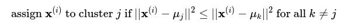
    

  3.  **Update Step (M-step - Maximization):** Recalculate the position of each cluster centroid by taking the mean of all data points assigned to that cluster.

    

      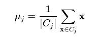
    

  4.  **Convergence:** Repeat steps 2 and 3 until the centroids no longer move significantly or a maximum number of iterations is reached.

* **Objective Function (Inertia/Within-Cluster Sum of Squares - WCSS):**

  * K-Means aims to minimize the sum of squared distances between data points and their assigned cluster centroid.

    

      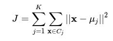
    

* **Choosing K (Elbow Method, Silhouette Score):**

  * One of the biggest challenges in K-Means is determining the optimal number of clusters, $K$.

  * **Elbow Method:** Plot the WCSS (or inertia) against different values of $K$. The point where the rate of decrease in WCSS sharply changes, forming an "elbow," is often considered the optimal $K$.

  * **Silhouette Score:** Measures how similar an object is to its own cluster (cohesion) compared to other clusters (separation). Scores range from -1 to 1, with higher values indicating better clustering.

* **Advantages and Disadvantages:**

  * **Pros:** Relatively simple to understand and implement, computationally efficient for large datasets, produces tight clusters if they are well-separated.

  * **Cons:** Requires specifying $K$ in advance, sensitive to initial centroid placement (can converge to local optima), sensitive to outliers, assumes spherical clusters of similar size, struggles with clusters of varying densities or non-convex shapes.

---

#### 6.1.2. Hierarchical Clustering (Conceptual)

Hierarchical clustering builds a hierarchy of clusters. It doesn't require specifying the number of clusters beforehand, and the result is typically represented as a **dendrogram**.

* **Agglomerative (Bottom-Up) vs. Divisive (Top-Down):**

  * **Agglomerative:** Starts with each data point as a single cluster and iteratively merges the closest pairs of clusters until all points are in one cluster or a stopping criterion is met. This is more common.

  * **Divisive:** Starts with all data points in one cluster and recursively splits the most appropriate cluster until each data point is a separate cluster.

* **Linkage Criteria (How to measure distance between clusters):**

  * **Single Linkage:** Distance between the closest points in the two clusters.

  * **Complete Linkage:** Distance between the farthest points in the two clusters.

  * **Average Linkage:** Average distance between all pairs of points across the two clusters.

  * **Ward's Method:** Minimizes the total within-cluster variance.

* **Dendrogram:** A tree-like diagram that records the sequence of merges or splits. You can "cut" the dendrogram at a certain height to obtain a desired number of clusters.

* **Advantages and Disadvantages:**
  * **Pros:** Does not require specifying $K$ beforehand, produces a hierarchy of clusters (dendrogram), can uncover nested relationships.

  * **Cons:** Can be computationally expensive (especially for large datasets), may struggle with large datasets, choosing the "cut" point on the dendrogram can be subjective.

---

### 6.2. Dimensionality Reduction Algorithms

Dimensionality Reduction techniques reduce the number of features (dimensions) in a dataset while trying to retain as much relevant information as possible. This is useful for visualization, noise reduction, and speeding up subsequent machine learning algorithms.

---

#### 6.2.1. Principal Component Analysis (PCA)

PCA is a widely used linear dimensionality reduction technique. It transforms the data into a new coordinate system such that the greatest variance by any projection of the data lies on the first coordinate (called the first principal component), the second greatest variance on the second coordinate, and so on.

* **Concept (Variance Maximization, Orthogonal Projection):**

  * PCA identifies directions (principal components) along which the data varies the most. These principal components are orthogonal (perpendicular) to each other.

  * It projects the high-dimensional data onto a lower-dimensional subspace spanned by these principal components, thereby reducing dimensionality while preserving the maximum possible variance (information).

* **Mathematical Foundation (Eigenvectors and Eigenvalues - Conceptual):**

  * PCA relies on finding the **eigenvectors** and **eigenvalues** of the data's covariance matrix.

  * **Covariance Matrix ($\Sigma$):** A square matrix that shows the covariance between each pair of features in the dataset.
    
    * For a dataset with $n$ features, $\Sigma$ will be an $n \times n$ matrix.

      

        
      

  * **Eigenvectors:** These are the principal components themselves. They are the directions of maximum variance in the data.

  * **Eigenvalues:** Each eigenvector has a corresponding eigenvalue, which quantifies the amount of variance captured along that principal component direction. Larger eigenvalues correspond to more significant principal components.

* **Steps (High-level):**

  1.  **Standardize the data:** Scale the features to have zero mean and unit variance. This is crucial as PCA is sensitive to the scale of features.
  
  2.  **Compute the covariance matrix:** Calculate the covariance matrix of the standardized data.
  
  3.  **Calculate eigenvectors and eigenvalues:** Find the eigenvectors and eigenvalues of the covariance matrix.
  
  4.  **Select principal components:** Order the eigenvectors by their corresponding eigenvalues in descending order. Choose the top $k$ eigenvectors (principal components) that capture a sufficient amount of variance (e.g., 95%).
  
  5.  **Transform the data:** Project the original (standardized) data onto the selected $k$ principal components.

* **Scree Plot / Explained Variance Ratio:**

  * **Explained Variance Ratio:** For each principal component, this indicates the proportion of the total variance in the dataset that is captured by that component.

  * **Scree Plot:** A plot of the eigenvalues (or explained variance ratio) against the number of principal components. Similar to the Elbow Method, it helps in choosing the optimal number of components.

* **Advantages and Disadvantages:**

  * **Pros:** Reduces dimensionality, speeds up algorithms, removes noise (by discarding lower variance components), can help visualize high-dimensional data (e.g., using 2 or 3 components).

  * **Cons:** Assumes linearity (identifies linear correlations), can be difficult to interpret the new principal components (they are linear combinations of original features), information loss is unavoidable.

---

## 7. Reinforcement Learning (Concepts & Algorithms)

Reinforcement Learning (RL) is a paradigm of machine learning concerned with how intelligent agents ought to take actions in an environment to maximize the notion of cumulative reward. Unlike supervised learning (which learns from labeled data) and unsupervised learning (which finds patterns in unlabeled data), RL learns through trial and error, getting feedback in the form of rewards or penalties from its actions.

---

### 7.1. Core Concepts in Reinforcement Learning

Understanding the fundamental components of an RL system is crucial before diving into algorithms.

* **Agent:** The learner or decision-maker that interacts with the environment.

* **Environment:** Everything outside the agent that the agent interacts with. It provides observations to the agent and responds to the agent's actions.

* **State ($S$):** A complete description of the current situation in the environment. It captures all relevant information the agent needs to make a decision.

  * Example: In a chess game, the state is the current position of all pieces on the board.

* **Action ($A$):** A move or decision made by the agent within a given state. The set of all possible actions for a given state is called the action space.

  * Example: In chess, moving a pawn to a specific square.

* **Reward ($R$):** A scalar feedback signal from the environment to the agent after performing an action in a state. The agent's goal is to maximize the cumulative reward over time.

  * Rewards can be immediate or delayed.

  * Example: +1 for winning a game, -1 for losing, 0 for any non-terminal move.

* **Policy ($\pi$):** The agent's strategy, which defines how the agent behaves given a state. It maps states to actions (or probabilities of taking actions).

  * **Deterministic Policy:** $\pi(s) = a$ (for a given state $s$, always take action $a$).

  * **Stochastic Policy:** $\pi(a|s)$ (for a given state $s$, take action $a$ with a certain probability).

* **Value Function ($V^\pi(s)$):** Represents the expected total cumulative reward an agent can expect to get starting from a given state $s$ and following a specific policy $\pi$. It quantifies "how good" a state is.

  

    $$V^\pi(s) = E_\pi \left[ \sum_{t=0}^{\infty} \gamma^t R_{t+1} \middle| S_0 = s \right]$$
  

* **Q-Value Function ($Q^\pi(s, a)$):** Also known as the **action-value function**. Represents the expected total cumulative reward an agent can expect to get starting from a given state $s$, taking a specific action $a$, and thereafter following policy $\pi$. It quantifies "how good" it is to take a particular action in a particular state.

  

    $$Q^\pi(s, a) = E_\pi \left[ \sum_{t=0}^{\infty} \gamma^t R_{t+1} \middle| S_0 = s, A_0 = a \right]$$
  

* **Discount Factor ($\gamma$ - gamma):** A value between 0 and 1. It determines the present value of future rewards.

  * A high $\gamma$ (closer to 1) means the agent cares more about future rewards (long-term thinking).

  * A low $\gamma$ (closer to 0) means the agent cares more about immediate rewards (short-term thinking).

  * The sum $\sum_{t=0}^{\infty} \gamma^t R_{t+1}$ ensures that rewards further in the future are "discounted" and weigh less.

---

### 7.2. Key Reinforcement Learning Algorithms

RL algorithms are broadly categorized into:

* **Model-Free vs. Model-Based:** Model-free algorithms learn directly from experience (trial and error) without explicitly understanding the environment's dynamics. Model-based algorithms try to learn a model of the environment (how states and rewards transition based on actions).

* **Value-Based vs. Policy-Based:** Value-based methods learn an optimal value function (or Q-value function) and derive a policy from it. Policy-based methods directly learn the optimal policy.

---

#### 7.2.1. Q-Learning (Value-Based, Model-Free)

Q-Learning is a popular off-policy, value-based reinforcement learning algorithm. "Off-policy" means it can learn the optimal policy even while following a different exploration policy.

* **Concept:** Q-Learning learns the optimal Q-value function, Q*(s, a), which represents the maximum expected future reward for taking action `a` in state `s`. Once Q*(s, a) is learned, the optimal policy is simply to take the action with the highest Q-value in any given state.

  

    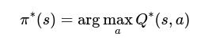
  

* **Q-Table:** For environments with a discrete and relatively small number of states and actions, Q-Learning often uses a **Q-table** to store the Q-values. The table has states as rows and actions as columns, with each cell $Q(s,a)$ holding the current estimate of the Q-value.

* **Bellman Equation for Optimality (Conceptual):**

  * The core of Q-Learning lies in the **Bellman Optimality Equation**, which states that the optimal Q-value for a state-action pair is the immediate reward plus the discounted maximum Q-value of the next state.

  

    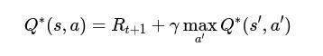
  

* **Q-Learning Update Rule:**

  * The algorithm iteratively updates the Q-values based on the agent's experience (state, action, reward, next state).

  

    $$Q(s,a) \leftarrow Q(s,a) + \alpha \left[ R + \gamma \max_{a'} Q(s',a') - Q(s,a) \right]$$
  

    Where:

    * $Q(s,a)$ is the current estimate of the Q-value for state $s$ and action $a$.

    * $\alpha$ (alpha) is the **learning rate** (similar to gradient descent), controlling how much new information overrides old information.

    * $R$ is the immediate reward received after taking action $a$ in state $s$.

    * $\gamma$ (gamma) is the **discount factor**.

    * $\max_{a'} Q(s',a')$ is the maximum Q-value for the next state $s'$ over all possible next actions $a'$. This is the "target" Q-value.

    * The term in the square brackets is the **Temporal Difference (TD) Error**, representing the difference between the current Q-value estimate and the updated (more accurate) estimate.

* **Exploration vs. Exploitation (Epsilon-Greedy Strategy):**

  * A crucial challenge in RL is balancing **exploration** (trying new actions to discover potentially better rewards) and **exploitation** (taking actions known to yield high rewards).

  * **Epsilon-Greedy:** A common strategy where the agent:

    * With probability $\epsilon$ (epsilon), chooses a random action (exploration).

    * With probability $1-\epsilon$, chooses the action with the highest Q-value (exploitation).

  * $\epsilon$ typically starts high and decays over time, allowing for more exploration initially and more exploitation as the agent learns.

* **Advantages and Disadvantages:**

  * **Pros:** Model-free (doesn't need to know environment dynamics), off-policy (can learn optimal policy while exploring), guaranteed to converge to optimal Q-values under certain conditions.

  * **Cons:** Can be slow to converge for large state/action spaces (Q-table becomes too large), struggles with continuous state/action spaces (needs discretization or function approximation).

---

#### 7.2.2. SARSA (State-Action-Reward-State-Action) (Value-Based, Model-Free)

SARSA is another popular on-policy, value-based reinforcement learning algorithm. "On-policy" means it learns the Q-value for the policy currently being followed, including its exploration strategy.

* **Concept:** SARSA is very similar to Q-Learning but with a key difference in how it calculates the "target" Q-value. Instead of taking the maximum Q-value of the next state, SARSA uses the Q-value of the *actual action taken* in the next state, according to the current policy.
* **SARSA Update Rule:**
    $$Q(s,a) \leftarrow Q(s,a) + \alpha \left[ R + \gamma Q(s',a') - Q(s,a) \right]$$
        Where:
        * $s, a, R, s'$ are the current state, action, reward, and next state, respectively.
        * $a'$ is the **action chosen in the next state $s'$ according to the current policy (e.g., epsilon-greedy)**. This is the crucial difference from Q-Learning, which uses $\max_{a'} Q(s',a')$.

* **On-Policy vs. Off-Policy (Key Distinction):**
    * **Q-Learning (Off-Policy):** Learns the optimal Q-function regardless of the policy being followed. It *imagines* taking the optimal action in the next state (the `max` part) even if it didn't actually take it for exploration.
    * **SARSA (On-Policy):** Learns the Q-function for the *actual policy being followed*. If the agent follows an epsilon-greedy policy, SARSA learns the Q-values for *that* epsilon-greedy policy. If the exploration part leads to a suboptimal action in the next state, SARSA factors that into its learning.

* **Advantages and Disadvantages:**
    * **Pros:** Model-free, can converge to optimal Q-values (for the current policy), often considered safer in certain environments because it accounts for exploration steps, leading to less "greedy" paths during training.
    * **Cons:** Still suffers from the curse of dimensionality for large state/action spaces, learning is tied to the exploration policy (if the exploration policy is poor, learning will be slow).

### 7.3. Deep Reinforcement Learning (Conceptual)

* **Concept:** When the state and/or action spaces are very large or continuous, using Q-tables becomes impossible. Deep Reinforcement Learning (DRL) combines standard RL algorithms with Deep Neural Networks.
    * Instead of a Q-table, a **deep neural network (a Q-network)** is used to approximate the Q-value function. The input to the network is the state, and the output can be the Q-value for each possible action, or a single Q-value for a given state-action pair.
    * The network's weights are updated using a variant of gradient descent on the TD error.
* **Algorithms:**
    * **Deep Q-Networks (DQN):** The pioneering DRL algorithm that successfully applied neural networks to Q-Learning, enabling agents to play Atari games from raw pixels.
    * **Policy Gradient Methods:** Directly learn the optimal policy parameters using gradient ascent.
    * **Actor-Critic Methods:** Combine elements of both value-based (critic) and policy-based (actor) methods.
* **Why it's crucial:** DRL has enabled RL to tackle complex, high-dimensional problems like robotics, game playing (AlphaGo, AlphaZero), and autonomous driving.

---

## 8. Deep Learning (Concepts & Architectures)

Deep Learning is a subfield of machine learning that is inspired by the structure and function of the human brain, particularly its neural networks. It involves training Artificial Neural Networks (ANNs) with multiple layers (hence "deep") to learn complex patterns and representations from vast amounts of data, often achieving state-of-the-art results in tasks like image recognition, natural language processing, and speech synthesis.

### 8.1. Introduction to Neural Networks

#### 8.1.1. The Perceptron (Basic Building Block)

The Perceptron is the simplest form of an artificial neuron and the foundational element of neural networks. Invented in 1957 by Frank Rosenblatt, it's a binary linear classifier.

* **Structure:**
    * Takes multiple binary or real-valued inputs ($x_1, x_2, \dots, x_n$).
    * Each input is multiplied by a corresponding **weight** ($w_1, w_2, \dots, w_n$), representing its importance.
    * These weighted inputs are summed up, and a **bias** term ($b$) is added.
    * The sum is passed through an **activation function** to produce an output.
* **Mathematical Representation:**
    The weighted sum is:
    $$z = \sum_{i=1}^{n} w_i x_i + b$$
    In vectorized form:
    $$z = \mathbf{w}^T \mathbf{x} + b$$
    The output $\hat{y}$ is:
    $$\hat{y} = \text{activation}(z)$$
* **Decision Boundary:** A single perceptron can only learn **linearly separable** patterns. It draws a single straight line (or hyperplane in higher dimensions) to separate the data points.

#### 8.1.2. Activation Functions

Activation functions introduce non-linearity into neural networks, allowing them to learn complex, non-linear relationships in data. Without them, a neural network, no matter how many layers it has, would essentially just be performing a linear transformation.

* **Role of Activation Functions:**
    * Transform the summed weighted input ($z$) into the neuron's output.
    * Introduce non-linearity, enabling the network to approximate complex functions.
    * Help control the output range of neurons.
* **Common Activation Functions:**
    * **Sigmoid (Logistic):** Squashes values between 0 and 1. Used in output layers for binary classification (Logistic Regression).
        $$\sigma(z) = \frac{1}{1 + e^{-z}}$$
        * **Issues:** Vanishing gradient problem (gradients become very small for large positive/negative inputs), output not zero-centered.
    * **ReLU (Rectified Linear Unit):** Most popular choice for hidden layers.
        $$\text{ReLU}(z) = \max(0, z)$$
        * **Pros:** Solves vanishing gradient problem (for positive inputs), computationally efficient.
        * **Cons:** "Dying ReLU" problem (neurons can become inactive if input is always negative).
    * **Leaky ReLU:** A variant of ReLU that attempts to solve the dying ReLU problem by allowing a small, non-zero gradient for negative inputs.
        $$\text{Leaky ReLU}(z) = \begin{cases} z & \text{if } z > 0 \\ \alpha z & \text{if } z \le 0 \end{cases}$$
        * Where $\alpha$ is a small positive constant (e.g., 0.01).
    * **Softmax:** Used in the output layer for multi-class classification. Converts scores into probabilities that sum to 1.
        $$\text{Softmax}(\mathbf{z})_k = \frac{e^{z_k}}{\sum_{j=1}^{K} e^{z_j}}$$
        * *Where $\mathbf{z}$ is the vector of outputs from the last layer, $K$ is the number of classes, and $z_k$ is the input for the $k$-th class.*

### 8.2. Backpropagation (Conceptual)

Backpropagation is the fundamental algorithm for training multi-layered artificial neural networks. It's an efficient way to calculate the gradients of the loss function with respect to the weights of the network, which are then used by optimization algorithms (like Gradient Descent) to update the weights.

* **Concept:**
    1.  **Forward Pass:** Input data is fed through the network layer by layer, and predictions are generated.
    2.  **Loss Calculation:** The difference between the network's predictions and the actual target values is calculated using a **loss function**.
    3.  **Backward Pass (Backpropagation):** The calculated loss is propagated backward through the network, from the output layer to the input layer. During this process, the algorithm calculates the **gradient** of the loss with respect to each weight and bias in the network using the **chain rule** of calculus.
    4.  **Weight Update:** The gradients inform an optimization algorithm (e.g., Gradient Descent) how to adjust the weights and biases to reduce the loss.
* **Role of Chain Rule:** Backpropagation leverages the chain rule to efficiently compute gradients across multiple layers. For example, to find how much the loss changes with respect to a weight in an early layer, it multiplies the partial derivatives of each function along the path from that weight to the final loss.

### 8.3. Common Deep Learning Architectures

Deep learning architectures are specialized types of neural networks designed for particular types of data and tasks.

#### 8.3.1. Feedforward Neural Networks (FNNs) / Multi-Layer Perceptrons (MLPs)

* **Structure:** The simplest deep neural network. Consists of an input layer, one or more hidden layers, and an output layer.
    * **Input Layer:** Receives the raw data.
    * **Hidden Layers:** Perform non-linear transformations on the data. Each neuron in a hidden layer is fully connected to all neurons in the previous layer.
    * **Output Layer:** Produces the final prediction.
* **How they work:** Information flows in one direction, from the input layer through the hidden layers to the output layer, without loops or cycles.
* **Applications:** Ideal for tabular data, regression tasks, simple classification, and as a component in more complex architectures.
* **Mathematical Operation (for one neuron in a layer):**
    $$y_j = \text{activation} \left( \sum_{i} W_{ji} x_i + b_j \right)$$
    * Where $y_j$ is the output of neuron $j$, $W_{ji}$ are the weights connecting input $x_i$ to neuron $j$, and $b_j$ is the bias for neuron $j$.

#### 8.3.2. Convolutional Neural Networks (CNNs)

CNNs are specifically designed for processing grid-like data, such as images. They are excellent at automatically learning spatial hierarchies of features.

* **Key Components:**
    * **Convolutional Layers:** The core building block. They apply a set of learnable filters (kernels) to the input data (e.g., image). Each filter slides over the input, performing dot products, to create feature maps. This captures local patterns (edges, textures).
        * **Mathematical intuition (2D convolution):**
            $$(I * K)(i,j) = \sum_m \sum_n I(i-m, j-n) K(m,n)$$
            * *Where $I$ is the input image, $K$ is the kernel/filter, and $(i,j)$ are the coordinates in the output feature map.*
    * **Pooling Layers (e.g., Max Pooling):** Downsample the feature maps, reducing their spatial dimensions and making the network more robust to small shifts/distortions in the input. Max pooling selects the maximum value in a window.
    * **ReLU Activation:** Typically used after convolutional layers.
    * **Fully Connected Layers:** At the end of the CNN, flattened feature maps are fed into one or more dense layers for final classification or regression.
* **Why they are powerful:** They leverage the spatial locality of pixels by sharing weights (the same filter is applied across the entire image), making them highly efficient and effective for image-related tasks.
* **Applications:** Image classification, object detection, facial recognition, medical image analysis.

#### 8.3.3. Recurrent Neural Networks (RNNs)

RNNs are designed to process sequential data, where the order of information matters. Unlike FNNs, RNNs have loops, allowing information to persist from one step to the next.

* **Concept:** They have "memory" of previous inputs in a sequence. The output at time $t$ depends not only on the input at time $t$ but also on the hidden state from time $t-1$.
* **Issue: Vanishing/Exploding Gradients:** Standard RNNs struggle with long-term dependencies (remembering information over many time steps) due to vanishing or exploding gradients during backpropagation through time.
* **Specialized RNN Architectures:**
    * **Long Short-Term Memory (LSTM) Networks:** Address the vanishing gradient problem by introducing "gates" (input, forget, output gates) that control the flow of information into and out of a cell state. This allows LSTMs to selectively remember or forget information over long sequences.
    * **Gated Recurrent Units (GRUs):** A simplified version of LSTMs, combining the forget and input gates into an update gate, and merging the cell state and hidden state. They often perform similarly to LSTMs but are computationally less intensive.
* **Applications:** Natural Language Processing (machine translation, text generation, sentiment analysis), speech recognition, time series prediction.

### 8.4. Training Deep Networks

Training deep neural networks can be challenging due to their complexity and many parameters. Several techniques are used to make the training process more stable, efficient, and effective.

* **Optimizers (Beyond basic Gradient Descent):**
    * Basic Gradient Descent (SGD) can be slow and get stuck. Optimizers adapt the learning rate during training or use momentum to speed up convergence and find better minima.
    * **Momentum:** Accelerates SGD in the relevant direction and dampens oscillations.
    * **AdaGrad (Adaptive Gradient):** Adapts the learning rate individually for each parameter, scaling it inversely proportional to the square root of the sum of squared past gradients. Good for sparse data.
    * **RMSprop (Root Mean Square Propagation):** Similar to AdaGrad but uses a moving average of squared gradients, preventing the learning rate from diminishing too quickly.
    * **Adam (Adaptive Moment Estimation):** Combines ideas from Momentum and RMSprop. It's often the default choice for many deep learning tasks due to its good performance.

* **Regularization Techniques (Preventing Overfitting):**
    * Deep networks have many parameters and can easily overfit. Regularization techniques aim to reduce overfitting by adding a penalty to the loss function or by modifying the network architecture.
    * **L1 and L2 Regularization (Weight Decay):** Add a penalty based on the magnitude of the weights to the loss function.
        * **L1 Regularization (Lasso):** Adds the sum of absolute values of weights ($\lambda \sum |w_i|$). Tends to produce sparse models (some weights become exactly zero), effectively performing feature selection.
        * **L2 Regularization (Ridge):** Adds the sum of squared weights ($\lambda \sum w_i^2$). Encourages smaller weights, leading to more robust models.
    * **Dropout:** During training, randomly sets a fraction of neurons to zero at each update. This forces the network to learn more robust features (as it cannot rely on any single neuron), acting as an ensemble of smaller networks.
        * **Concept:** For each training iteration, different subsets of neurons are "dropped out."
        * **Application:** Applied to hidden layers. A dropout rate (e.g., 0.5) specifies the probability of dropping a neuron.
* **Batch Normalization:**
    * **Concept:** Normalizes the inputs to each layer (specifically, the activations before applying the non-linear activation function) across a mini-batch. It shifts and scales the activations to have zero mean and unit variance.
    * **Benefits:**
        * Speeds up training (allows higher learning rates).
        * Reduces internal covariate shift (changes in the distribution of layer inputs during training).
        * Acts as a regularizer, reducing the need for Dropout in some cases.
        * Makes networks less sensitive to initial weights.
    * **Placement:** Typically placed after the linear transformation and before the activation function in a layer.

---

## 9. Natural Language Processing (Concepts & Deep Learning)

Natural Language Processing (NLP) is a subfield of artificial intelligence that focuses on enabling computers to understand, interpret, and generate human language in a way that is both meaningful and useful. NLP bridges the gap between human communication and computer understanding, making it possible for machines to interact with us in natural ways and process vast amounts of unstructured text data.

### 9.1. Introduction to NLP

* **Definition:** NLP involves the computational treatment of human language. It combines computational linguistics (rule-based modeling of language) with machine learning and deep learning to process, analyze, and generate text and speech.
* **Goal:** To enable computers to understand, interpret, and manipulate human language effectively, mimicking cognitive abilities related to language.
* **Challenges:** Human language is inherently complex and ambiguous.
    * **Ambiguity:** Words and phrases can have multiple meanings depending on context (e.g., "bank" of a river vs. financial bank).
    * **Context Sensitivity:** Meaning often relies on surrounding words, sentences, or even external knowledge.
    * **Variability:** Slang, dialects, misspellings, sarcasm, nuances.
    * **Syntactic Complexity:** Grammar rules can be intricate and vary widely.
    * **Semantic Complexity:** Understanding the actual meaning and relationships between words and concepts.

### 9.2. Traditional NLP Techniques (Rule-Based & Statistical)

Before the advent of deep learning, NLP primarily relied on rule-based systems, statistical methods, and shallow machine learning models.

#### 9.2.1. Text Preprocessing

These are initial steps to clean and prepare raw text data for analysis.

* **Tokenization:** Breaking down a text into smaller units called "tokens" (words, subwords, punctuation, numbers).
    * Example: "Hello, world!" $\rightarrow$ ["Hello", ",", "world", "!"]
* **Stemming & Lemmatization:** Reducing words to their base or root form.
    * **Stemming:** A crude heuristic process that chops off ends of words (e.g., "running", "runs", "ran" $\rightarrow$ "run"). May result in non-dictionary words. (e.g., using Porter Stemmer).
    * **Lemmatization:** A more sophisticated process that uses a vocabulary and morphological analysis to return the dictionary base form (lemma) of a word (e.g., "running", "runs", "ran" $\rightarrow$ "run").
* **Stop Word Removal:** Eliminating common words (e.g., "the", "a", "is", "are") that carry little semantic meaning and often add noise.
* **Lowercasing:** Converting all text to lowercase to ensure consistency (e.g., "The" and "the" are treated as the same word).

#### 9.2.2. Feature Engineering for Text

Transforming text into numerical representations that machine learning models can understand.

* **Bag-of-Words (BoW):**
    * **Concept:** Represents a document as an unordered collection of words, disregarding grammar and word order but keeping track of word frequencies.
    * **Process:**
        1.  Create a vocabulary of all unique words in the entire corpus.
        2.  For each document, count the frequency of each word from the vocabulary.
        3.  The document is represented as a vector where each dimension corresponds to a word in the vocabulary, and its value is the word's count.
    * **Limitations:** Loses word order and context, vocabulary size can be very large for large corpora, leading to sparse vectors.
* **TF-IDF (Term Frequency-Inverse Document Frequency):**
    * **Concept:** A statistical measure that evaluates how relevant a word is to a document in a collection of documents. It increases proportionally to the number of times a word appears in the document but is offset by the frequency of the word in the corpus.
    * **Formula:**
        $$\text{TFIDF}(t, d, D) = \text{TF}(t, d) \times \text{IDF}(t, D)$$
        Where:
        * **Term Frequency (TF):** $\text{TF}(t, d) = \frac{\text{Number of times term } t \text{ appears in document } d}{\text{Total number of terms in document } d}$
        * **Inverse Document Frequency (IDF):** $\text{IDF}(t, D) = \log \left( \frac{\text{Total number of documents in corpus } D}{\text{Number of documents } d \text{ with term } t} \right)$
    * **Benefits:** Captures importance of words beyond just frequency, helps in identifying distinguishing terms.

#### 9.2.3. Basic Models

* **N-grams:** Contiguous sequence of `n` items (words, characters) from a given sample of text or speech. Used to capture local word order.
    * Example (bigrams, N=2): "I love NLP" $\rightarrow$ ("I", "love"), ("love", "NLP")
* **Naive Bayes:** A probabilistic classifier commonly used for text classification (e.g., spam detection, sentiment analysis) due to its simplicity and effectiveness with high-dimensional data like text features (BoW, TF-IDF).

### 9.3. Word Embeddings (Distributed Representations)

Traditional methods like BoW or TF-IDF treat words as independent units (one-hot encoding), failing to capture semantic relationships. Word embeddings are dense, low-dimensional vector representations of words that capture their meanings and relationships based on their context in a large corpus.

* **Concept:** Words that appear in similar contexts often have similar meanings. Word embeddings aim to map words to a continuous vector space where semantically similar words are located closer to each other.
* **Benefits:**
    * Capture semantic and syntactic relationships between words (e.g., vector("king") - vector("man") + vector("woman") $\approx$ vector("queen")).
    * Reduce dimensionality compared to one-hot encoding.
    * Provide a dense representation that deep learning models can effectively use.

#### 9.3.1. Word2Vec

One of the most influential early models for creating word embeddings. It comes in two main architectures:

* **Skip-gram:** Predicts surrounding context words given a target word. (More common for larger datasets).
* **CBOW (Continuous Bag-of-Words):** Predicts a target word given its surrounding context words.
* **Training:** Word2Vec models are trained on large text corpora by maximizing the probability of context words given a target word (or vice versa).
* **Output:** A lookup table (vector space) where each word in the vocabulary is mapped to a unique vector.

#### 9.3.2. GloVe & FastText (Brief Mention)

* **GloVe (Global Vectors for Word Representation):** Combines aspects of both global matrix factorization (like LSA) and local context window methods (like Word2Vec) to capture co-occurrence statistics.
* **FastText:** An extension of Word2Vec that considers subword information (character n-grams), allowing it to handle out-of-vocabulary words and morphologically rich languages better.

### 9.4. Deep Learning for NLP

Deep learning has revolutionized NLP, enabling models to learn hierarchical features and capture long-range dependencies in text.

#### 9.4.1. Recurrent Neural Networks (RNNs) in NLP

*(Refer to Section 8.3.3 for core RNN concepts, LSTMs, and GRUs.)*

* **Application in NLP:** RNNs were naturally suited for sequential data like text. They process words one by one, maintaining a hidden state that acts as a "memory" of past words in the sequence.
* **Encoder-Decoder Architecture:** Commonly used for sequence-to-sequence tasks (e.g., machine translation). An encoder RNN reads the input sequence and compresses it into a fixed-length context vector. A decoder RNN then generates the output sequence using this context vector.
* **Limitations:** Despite their strength, standard RNNs (and even LSTMs/GRUs) still faced challenges with very long sequences due to:
    * **Long-range dependencies:** Difficulty in effectively carrying information over very long stretches of text.
    * **Sequential processing:** Inherently slow for training as computations cannot be easily parallelized.

#### 9.4.2. Attention Mechanism

* **Concept:** The Attention Mechanism was introduced to address the bottleneck of the fixed-length context vector in encoder-decoder RNNs and to allow the decoder to "pay attention" to different parts of the input sequence when generating each part of the output sequence.
* **How it works (conceptual):** Instead of a single context vector, the decoder gets access to all encoder hidden states. When generating a word, it calculates "attention weights" to determine which parts of the input sequence are most relevant for the current output word.
* **Benefits:** Improves performance on long sequences, makes models more interpretable (by showing attention weights).
* **Seq2Seq with Attention:** The combination of RNN Encoder-Decoder architectures with attention mechanisms became the state-of-the-art for tasks like machine translation before the Transformer era.

#### 9.4.3. Transformers

* **Concept:** The Transformer architecture, introduced in 2017 ("Attention Is All You Need"), completely revolutionized NLP by ditching recurrence and convolutions and relying solely on **self-attention mechanisms**. This allows for highly parallelizable computation and better handling of long-range dependencies.
* **Self-Attention:** Allows each word in an input sequence to weigh the importance of all other words in the same sequence when calculating its own representation. This directly captures relationships between words, regardless of their distance.
* **Positional Encoding:** Since Transformers process words in parallel without recurrence, they need a way to incorporate information about the word's position in the sequence. Positional encodings (fixed or learned) are added to the word embeddings to provide this crucial positional context.
* **Encoder-Decoder Architecture:** The original Transformer consists of an
* Computer Vision (CV)
* Reinforcement Learning
* Deployment of ML Models (Brief mention)
* Ethics in AI/ML Encoder stack (for understanding input) and a Decoder stack (for generating output).
    * **Encoder:** Maps an input sequence of symbol representations $(x_1, ..., x_n)$ to a sequence of continuous representations $(z_1, ..., z_n)$.
    * **Decoder:** Given $z_1, ..., z_n$, the decoder generates an output sequence $(y_1, ..., y_m)$ one element at a time.
* **Benefits:**
    * **Parallelization:** Enables faster training on GPUs.
    * **Long-range dependencies:** Excellently captures relationships between distant words.
    * **Scalability:** Forms the basis for very large language models.

#### 9.4.4. Pre-trained Language Models (PLMs)

* **Concept:** The dominant paradigm in modern NLP. Instead of training a model from scratch for each specific NLP task, a large Transformer-based model is first **pre-trained** on a massive, diverse corpus of unlabelled text (e.g., the entire internet, books) using self-supervised learning tasks (e.g., predicting masked words). This pre-training phase allows the model to learn deep linguistic patterns, grammar, semantics, and even some world knowledge.
* **Fine-tuning:** After pre-training, the model is **fine-tuned** on a smaller, task-specific labeled dataset (e.g., for sentiment analysis, named entity recognition). The pre-trained weights are adjusted to adapt to the new task. This is a form of transfer learning (see Section 9.2).
* **Two Main Categories (based on Transformer architecture):**
    * **Encoder-only Models (e.g., BERT):**
        * **Bidirectional Encoder Representations from Transformers (BERT):** Developed by Google. It's pre-trained to understand context bidirectionally (looking at words to its left and right).
        * **Pre-training Tasks:**
            * **Masked Language Model (MLM):** Randomly masks some words in a sentence and the model tries to predict them.
            * **Next Sentence Prediction (NSP):** The model predicts if one sentence logically follows another.
        * **Applications:** Excellent for understanding tasks like text classification, question answering, named entity recognition.
    * **Decoder-only Models (e.g., GPT series):**
        * **Generative Pre-trained Transformer (GPT):** Developed by OpenAI. It's pre-trained to generate text autoregressively, predicting the next word given all previous words. It's unidirectional.
        * **Pre-training Task:** Casual Language Modeling (predicting the next token).
        * **Applications:** Primarily used for text generation, summarization, creative writing, chatbots.
        * **In-context Learning / Few-shot Learning:** With large enough models, they can perform tasks with only a few examples provided in the prompt, without explicit fine-tuning.

### 9.5. NLP Tasks & Applications (Overview)

Deep learning has significantly advanced performance across a wide range of NLP tasks:

* **Text Classification:** Categorizing text into predefined classes (e.g., Sentiment Analysis - positive/negative/neutral; Spam Detection - spam/not spam; Topic Labeling - sports/politics/tech).
* **Named Entity Recognition (NER):** Identifying and classifying named entities (e.g., person names, organizations, locations, dates) in text.
* **Machine Translation:** Automatically translating text from one natural language to another (e.g., English to French).
* **Text Summarization:** Condensing longer texts into shorter, coherent summaries.
    * **Extractive Summarization:** Selects important sentences/phrases directly from the original text.
    * **Abstractive Summarization:** Generates new sentences that capture the core meaning, potentially using words not in the original text.
* **Question Answering (QA):** Systems that can answer questions posed in natural language by extracting information from a given text or knowledge base.
* **Chatbots / Conversational AI:** AI systems designed to simulate human conversation through text or voice, used for customer service, virtual assistants, etc.
* **Speech Recognition (Speech-to-Text):** Converting spoken language into written text.
* **Text-to-Speech (TTS):** Synthesizing human-like speech from written text.

---

## 9. Contribution Guidelines
* How to contribute (issues, pull requests)
* Code of Conduct

---

## 10. License
* MIT License

