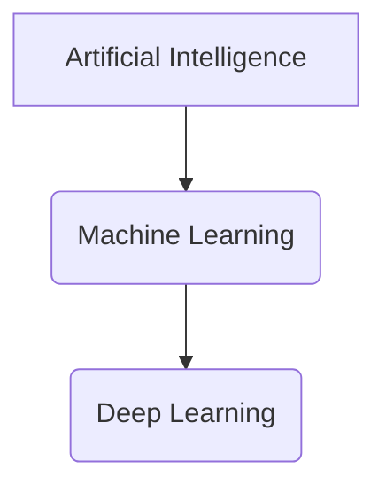

-------

# Machine Learning For Beginners

Embark on your Machine Learning journey with confidence! This repository is your comprehensive guide to understanding the fundamental concepts and the essential mathematics that power machine learning. Designed for absolute beginners, it demystifies complex topics, offering clear explanations, intuitive examples, and the underlying mathematical intuition you need to truly grasp how ML algorithms work. Whether you're an aspiring data scientist, a curious developer, or just someone eager to understand the buzz around AI, this resource will build a strong foundation for your future in Machine Learning."

---

## Table of Contents

* [1. Introduction to Machine Learning](#1-introduction-to-machine-learning)
    * [1.1 What is Machine Learning?](#11-what-is-machine-learning)
    * [1.2 Why Learn Machine Learning?](#12-why-learn-machine-learning)
    * [1.3 Types of Machine Learning](#13-types-of-machine-learning)
* [2. Prerequisites for Machine Learning](#2-prerequisites-for-machine-learning)
    * [2.1 Python Basics](#21-python-basics)
    * [2.2 Fundamental Math Concepts (Overview)](#22-fundamental-math-concepts-overview)
    * [2.3 Recommended Libraries](#23-recommended-libraries-for-conceptual-understanding-not-necessarily-coding-yet)
* [3. Core Concepts in Machine Learning](#3-core-concepts-in-machine-learning)
    * [3.1 Data Fundamentals](#31-data-fundamentals)
    * [3.2 Model Training & Evaluation](#32-model-training--evaluation)
    * [3.3 Feature Engineering](#33-feature-engineering)
    * [3.4 Optimization](#34-optimization)
* [4. Mathematical Foundations for Machine Learning](#4-mathematical-foundations-for-machine-learning)
    * [4.1 Linear Algebra](#41-linear-algebra)
    * [4.2 Calculus](#42-calculus)
    * [4.3 Probability & Statistics](#43-probability--statistics)
* [5. Supervised Learning Algorithms (Concepts & Math)](#5-supervised-learning-algorithms-concepts--math)
    * [5.1 Regression Algorithms](#51-regression-algorithms)
        * [5.1.1 Linear Regression](#511-linear-regression)
        * [5.1.2 Polynomial Regression](#512-polynomial-regression-brief-overview-transformation-of-linear-regression)
    * [5.2 Classification Algorithms](#52-classification-algorithms)
        * [5.2.1 Logistic Regression](#521-logistic-regression)
        * [5.2.2 K-Nearest Neighbors (KNN)](#522-k-nearest-neighbors-knn)
        * [5.2.3 Decision Trees](#523-decision-trees)
        * [5.2.4 Support Vector Machines (SVM)](#524-support-vector-machines-svm-conceptual-introduction)
* [6. Unsupervised Learning Algorithms (Concepts & Math)](#6-unsupervised-learning-algorithms-concepts--math)
    * [6.1 Clustering Algorithms](#61-clustering-algorithms)
        * [6.1.1 K-Means Clustering](#611-k-means-clustering)
        * [6.1.2 Hierarchical Clustering](#612-hierarchical-clustering-conceptual)
    * [6.2 Dimensionality Reduction](#62-dimensionality-reduction)
* [7. Model Selection & Improvement (Advanced Beginner Topics)](#7-model-selection--improvement-advanced-beginner-topics)
* [8. Next Steps & Further Learning](#8-next-steps--further-learning)
* [9. Contribution Guidelines](#9-contribution-guidelines)
* [10. License](#10-license)

---

## 1. Introduction to Machine Learning

Welcome to the exciting world of Machine Learning! This section lays the groundwork by defining what Machine Learning is, why it's so prevalent, and the main categories of ML systems you'll encounter.

---

### 1.1 What is Machine Learning?

Machine Learning (ML) is a subset of Artificial Intelligence (AI) that empowers computers to **learn from data without being explicitly programmed**. Instead of writing specific instructions for every possible scenario, you feed an ML algorithm a vast amount of data, and it learns to identify patterns, make predictions, or make decisions based on those patterns.

The core idea here is to train a "model" using data. Once trained, this model can then make predictions or inferences on new, unseen data.

* Definition and Goals
  
  * **Definition:** Machine Learning is the study of computer algorithms that improve automatically through experience and by the use of data.
  
  * **Goals:**

    * **Prediction:** Forecasting future outcomes (e.g., predicting stock prices, house values).

    * **Classification:** Categorizing data into predefined classes (e.g., spam detection, image recognition).

    * **Clustering:** Grouping similar data points together (e.g., customer segmentation).

    * **Recommendation:** Suggesting items or content (e.g., Netflix recommendations).

    * **Anomaly Detection:** Identifying unusual patterns (e.g., fraud detection).

* AI vs. ML vs. Deep Learning (Brief Overview)

  * **Artificial Intelligence (AI):** The broader concept of machines executing tasks that require human-like intelligence (e.g., reasoning, problem-solving, understanding language). ML is a major subfield of AI.

  * **Machine Learning (ML):** As defined above, focuses on systems that learn from data. All ML is AI, but not all AI is ML.

  * **Deep Learning (DL):** A specialized subfield of ML that uses artificial neural networks with multiple layers (hence "deep") to learn complex patterns. DL has revolutionized fields like computer vision and natural language processing. All DL is ML, but not all ML is DL.

---

### 1.2 Why Learn Machine Learning?

Machine Learning isn't just a buzzword; it's a transformative technology impacting nearly every industry and aspect of our lives. Understanding ML is becoming an essential skill in our data-driven world.

* Applications and Impact (Real-world examples)

  - **Healthcare:** Disease diagnosis, drug discovery, personalized treatment plans.
  - **Finance:** Fraud detection, algorithmic trading, credit scoring.
  - **E-commerce:** Product recommendations, targeted advertising, inventory management.
  - **Transportation:** Self-driving cars, traffic prediction.
  - **Customer Service:** Chatbots, sentiment analysis.
  - **Entertainment:** Content recommendations (Netflix, Spotify), video game AI.
  - **Security:** Facial recognition, cybersecurity threat detection.
  - **Science:** Climate modeling, material science, genomics.

---

### 1.3 Types of Machine Learning

Machine learning problems are broadly categorized based on the nature of the training data and the task the algorithm is designed to perform.

* **Supervised Learning**

  - **Definition:** The algorithm learns from **labeled data**, meaning each training example includes both the input features and the correct output (label). The goal is to learn a mapping from inputs to outputs so that the model can predict outputs for new, unseen inputs.

  - **Analogy:** Learning with a teacher who provides correct answers.

  - **Common Tasks:**

    - **Regression:** Predicting a continuous numerical value (e.g., house price, temperature).

    - **Classification:** Predicting a discrete category or class (e.g., spam/not-spam, disease/no-disease).

  - **Examples:** Image classification (cat/dog), spam detection, predicting house prices, credit risk assessment.

* **Unsupervised Learning**

  - **Definition:** The algorithm learns from **unlabeled data**, where only input features are provided without any corresponding output labels. The goal is to find hidden patterns, structures, or relationships within the data.

  - **Analogy:** Learning without a teacher, discovering patterns on your own.

  - **Common Tasks:**

    - **Clustering:** Grouping similar data points together (e.g., customer segmentation, gene clustering).

    - **Dimensionality Reduction:** Reducing the number of features in a dataset while retaining most of the important information (e.g., for visualization, noise reduction).

    - **Association Rule Mining:** Discovering relationships between variables in large datasets (e.g., "customers who buy X also buy Y").

- **Examples:** Market segmentation, anomaly detection, topic modeling in documents.

* **Reinforcement Learning (Brief Introduction)**

  - **Definition:** An agent learns to make decisions by performing actions in an environment to maximize a cumulative reward. It learns through trial and error, getting positive or negative feedback for its actions.

  - **Analogy:** Training a pet with rewards.

  - **Examples:** Game AI (AlphaGo), robotics, autonomous driving.

* **Semi-supervised Learning (Brief Introduction)**

  - **Definition:** Uses a combination of a small amount of labeled data and a large amount of unlabeled data during training. It can be useful when obtaining labeled data is expensive or time-consuming.

  - **Example:** Image classification where only a few images are manually tagged, and the algorithm uses unlabeled images to improve its understanding.

---

## 2. Prerequisites for Machine Learning

Before diving deep into the fascinating world of Machine Learning, having a foundational understanding of a few key areas will significantly enhance your learning experience.

---

### 2.1 Python Basics:

Python is the lingua franca of Machine Learning due to its simplicity, vast ecosystem of libraries, and strong community support. A basic grasp of these Python concepts is essential:

- **Variables, Data Types (Lists, Tuples, Dictionaries):** Understanding how to store and manipulate different types of data.

- **Control Flow (If/Else, Loops):** How to write conditional logic and iterate over data.

- **Functions:** Defining reusable blocks of code.

- **Object-Oriented Programming (Basic concepts for classes/objects):** While not strictly necessary for every ML script, understanding basic OOP concepts (like what an object is and how to use methods) will be helpful when working with ML libraries like Scikit-learn, which are built using OOP principles.

---

### 2.2 Fundamental Math Concepts (Overview):

Don't let the word "math" intimidate you! For beginners, the focus isn't on proving theorems but on understanding the intuition behind the concepts and how they apply to ML. This repository will delve into the _math behind it_ in subsequent sections, but a high-level familiarity helps:

- **Algebra (Equations, Functions):** The backbone of representing relationships between variables.

- **Basic Calculus (Derivatives - intuition for optimization):** Understanding the concept of a derivative as a "rate of change" or "slope." This intuition is vital for grasping how ML models "learn" by minimizing errors (optimization).

- **Basic Linear Algebra (Vectors, Matrices, Dot Products - intuition for data representation):** Knowing what vectors and matrices are, and how they represent data in a structured way (e.g., a dataset is a matrix, a single data point is a vector). The dot product is fundamental for many operations.

- **Basic Probability & Statistics (Mean, Median, Mode, Variance, Standard Deviation, Distributions):** These concepts help in understanding data characteristics, dealing with uncertainty, and evaluating model performance.

---

### 2.3 Recommended Libraries (for conceptual understanding, not necessarily coding yet):

While we'll focus on the concepts and math, you'll inevitably interact with these Python libraries in any practical ML endeavor. Familiarizing yourself with their purpose will be beneficial:

- **NumPy:** The fundamental package for numerical computing in Python. It provides powerful array objects and tools for working with them efficiently. All other scientific libraries often build upon NumPy arrays.

- **Pandas:** An essential library for data manipulation and analysis. It introduces DataFrames, which are tabular data structures (like spreadsheets) that make working with structured data intuitive and efficient.

- **Matplotlib/Seaborn:** Libraries for creating static, interactive, and animated visualizations in Python. Visualizing data and model results is a crucial part of the ML workflow.

---

## 3. Core Concepts in Machine Learning

This section introduces the foundational concepts that underpin almost all machine learning processes. Understanding these ideas is crucial before diving into specific algorithms, as they form the common language and principles used throughout the field.

---

### 3.1 Data Fundamentals:

At the heart of machine learning is data. How data is structured, characterized, and prepared directly impacts the performance of your models.

- **Types of Data:**

  - **Numerical Data:** Represents quantities and can be measured.
    - **Continuous:** Can take any value within a range (e.g., temperature, height, price).
    - **Discrete:** Can only take specific, distinct values, often integers (e.g., number of children, counts).
  
  - **Categorical Data:** Represents categories or groups.
    - **Nominal:** Categories with no inherent order (e.g., colors - red, blue, green; marital status).
    - **Ordinal:** Categories with a meaningful order (e.g., education level - high school, bachelor's, master's; rating - low, medium, high).

- **Features and Labels (Independent vs. Dependent Variables):**

  - **Features (Independent Variables / Inputs):** The individual measurable properties or characteristics of the phenomenon being observed. These are the pieces of information your model uses to make predictions. In a dataset, these are typically the columns that describe each instance.
  - **Labels (Dependent Variables / Outputs / Targets):** The variable that you are trying to predict or explain. For supervised learning, this is the "answer" provided in the training data.
  - **Example:** In predicting house prices: "Number of bedrooms," "Square footage," "Location" are **features**, and "House price" is the **label**.

-   **Datasets (Training, Validation, Test Sets):**
  - To build robust ML models, datasets are typically split into three parts:
    - **Training Set:** The largest portion of the data, used to train the machine learning model. The model learns patterns from this data.
    - **Validation Set (or Development Set):** Used to tune the model's hyperparameters and to provide an unbiased evaluation of a model _while tuning model hyperparameters_. It helps in preventing overfitting to the training data.
    - **Test Set:** A completely unseen portion of the data, used _only once_ at the very end to provide a final, unbiased evaluation of the model's performance. It gives an estimate of how the model will perform on real-world, new data.

- **Data Quality (Missing Values, Outliers):**
  - **Missing Values:** Data points that are not recorded for a feature. These need to be handled (e.g., by imputation or removal) as most ML algorithms cannot work with missing data.
  - **Outliers:** Data points that significantly deviate from other observations. Outliers can skew model training and lead to inaccurate results if not handled appropriately.

---

### 3.2 Model Training & Evaluation:

This describes the core process of building and assessing an ML model.

- **What is a Model?**

  - In machine learning, a "model" is the output of the training process. It's a mathematical function or a set of rules that has learned patterns from the training data. The model can then be used to make predictions or decisions on new data.

- **Training a Model:**

  - The process of feeding data to a machine learning algorithm so that it can learn the relationships and patterns within that data. During training, the model's internal parameters are adjusted iteratively to minimize a defined error.

- **Prediction/Inference:**

  - Once a model is trained, **prediction** (or **inference**) is the process of using the trained model to make an output for new, unseen input data.

- **Underfitting vs. Overfitting:**

  - **Underfitting:** Occurs when a model is too simple to capture the underlying patterns in the training data. It performs poorly on both training and test data, indicating that it hasn't learned enough.
  
  - **Overfitting:** Occurs when a model learns the training data _too well_, including noise and irrelevant details. It performs excellently on the training data but poorly on unseen test data, as it fails to generalize.

  - **Bias-Variance Tradeoff (Mathematical Intuition):**

    - This is a central concept in understanding model performance.
    
    - **Bias:**  The error introduced by approximating a real-world problem, which may be complex, by a simplified model. High bias leads to underfitting.

    - **Variance:** The amount that the estimate of the target function will change if different training data was used. High variance leads to overfitting.
    
    - **Tradeoff:** There's an inverse relationship between bias and variance. Reducing one often increases the other. The goal is to find a balance that minimizes the total error (Bias^2 + Variance + Irreducible Error).

      

        $$Total Error = Bias^2 + Variance + Irreducible Error$$
      

* **Model Evaluation Metrics (General Overview for now, detailed later):**

  * After training, we need to assess how well our model performs. Different metrics are used depending on the type of problem (regression vs. classification).

  * **For Regression:**

    * **Mean Squared Error (MSE):** Average of the squared differences between predicted and actual values. Penalizes larger errors more.

      

        $$\text{MSE} = \frac{1}{N} \sum_{i=1}^{N} (y_i - \hat{y}_i)^2$$
      

      * **N**: The total number of data points or observations.
      * **$Y_i$**: The actual or observed value for the _i_-th data point.
      * **$\hat{Y}_i$**: The predicted value for the _i_-th data point, as generated by the model.
      * **$(Y_i - \hat{Y}_i)$**: This is the error (or residual) for the _i_-th prediction. It represents the difference between the actual value and the predicted value.
      * **$(Y_i - \hat{Y}_i)^2$**: The error for each prediction is squared. This has two important consequences:
        1. **Positive Values:** Squaring ensures that all error terms are positive. This prevents negative and positive errors from canceling each other out.
        2. **Penalizing Larger Errors:** Squaring gives a higher weight to larger errors. A large discrepancy between the actual and predicted value will result in a significantly larger squared error than a small discrepancy.
      * **$\sum_{i=1}^{N}$**: This is the summation symbol, indicating that the squared errors for all _N_ data points are added together.
      * **$\frac{1}{N}$**: The sum of the squared errors is then divided by the number of data points to get the average or mean.

    * **Mean Absolute Error (MAE):** Average of the absolute differences between predicted and actual values. Less sensitive to outliers than MSE.

      

        $$\text{MAE} = \frac{1}{N} \sum_{i=1}^{N} |y_i - \hat{y}_i|$$
      

      * **N**: The total number of data points or observations.
      * **$Y_i$**: The actual or observed value for the _i_-th data point.
      * **$\hat{Y}_i$**: The predicted value for the _i_-th data point, as generated by the model.
      * **$|Y_i - \hat{Y}_i|$**: This is the error (or residual) for the _i_-th prediction. It represents the absolute difference between the actual value and the predicted value.
      * **$\sum_{i=1}^{N}$**: This is the summation symbol, indicating that the squared errors for all _N_ data points are added together.
      * **$\frac{1}{N}$**: The sum of the absolute errors is then divided by the number of data points to get the average or mean.

    * **R-squared (R2):** **R-squared error**, more commonly known as $R^2$ **(R-squared)** or the **coefficient of determination** is a statistical measure used to evaluate the **goodness of fit** of a regression model. It tells us how much of the **variance in the dependent variable (target)** is **explained by the independent variable(s)** in the model.

      

        $$R^2 = 1 - \frac{SS_{res}}{SS_{total}}$$
      

      * $SS_{res}:$ Residual sum of squares = $∑(yᵢ - ŷᵢ)²$
      * $SS_{tot}:$ Total sum of squares = $∑(yᵢ - ȳ)²$
      * $yᵢ:$ Actual value
      * $ŷᵢ:$ Predicted value
      * $ȳ:$ Mean of actual values

    * **For Classification:**

      * **Accuracy:** The proportion of correctly predicted instances out of the total instances. (Can be misleading with imbalanced datasets).

      * **Precision:** The proportion of correctly predicted positive observations out of all predicted positives. "Of all the times we predicted positive, how many were actually positive?"

      * **Recall (Sensitivity):** The proportion of correctly predicted positive observations out of all actual positives. "Of all the actual positives, how many did we correctly identify?"

      * **F1-Score:** The harmonic mean of Precision and Recall. Useful when you need a balance between Precision and Recall.

      * **Confusion Matrix:** A table that summarizes the performance of a classification model, showing True Positives, True Negatives, False Positives, and False Negatives. (Will be detailed in classification algorithms).

---

### 3.3 Feature Engineering:

The process of creating new features or transforming existing ones from raw data to improve the performance of machine learning models. It's often more impactful than algorithm tuning.

- **Definition and Importance:**

    - **Definition:** The art of creating new input features from existing ones that are more informative and useful for your machine learning model.

    - **Importance:** Well-engineered features can significantly boost model accuracy, even with simpler algorithms, by allowing the model to better understand the underlying patterns.

- **Common Techniques:**

  - **One-hot encoding:** Converting categorical variables into a numerical format that ML algorithms can understand without implying an artificial order. For a feature with N categories, it creates N new binary features.

  - **Scaling:** Adjusting the range of feature values.

    - **Standardization (Z-score normalization):** Rescales data to have a mean (μ) of 0 and a standard deviation (σ) of 1.

      

        $$z = \frac{x - \mu}{\sigma}$$
      

    - **Normalization (Min-Max scaling):** Rescales data to a fixed range, usually between 0 and 1.

      

        $$x_{scaled} = \frac{x - x_{min}}{x_{max} - x_{min}}$$
      

    - **Why Scale?** Many ML algorithms (like Gradient Descent, KNN, SVM) are sensitive to the scale of input features because they involve distance calculations or weight updates. Scaling prevents features with larger ranges from dominating the learning process.

---

### 3.4 Optimization:

It is the process of finding the best set of model parameters that minimize the model's error (cost/loss).

- **Cost/Loss Functions (What they are, why we use them):**

  - **Definition:** A function that quantifies the "error" or "cost" associated with a model's predictions. The lower the cost, the better the model's performance.

  - **Why use them?** They provide a measurable objective that the ML algorithm tries to minimize during training, guiding the learning process. Different ML tasks (e.g., regression vs. classification) use different types of cost functions.

- **Gradient Descent (Intuition and basic math for univariate):**

  - **Definition:** An iterative optimization algorithm used to find the minimum of a function (our cost function). It works by taking small steps in the direction of the steepest decrease of the function.

  - **Intuition:** If you're walking on a curve, the derivative tells you how steep the path is at your current location and in which direction (uphill/downhill).

