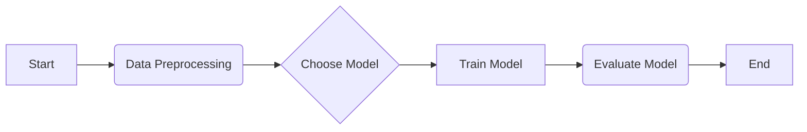

# Machine Learning For Beginners

Embark on your Machine Learning journey with confidence! This repository is your comprehensive guide to understanding the fundamental concepts and the essential mathematics that power machine learning. Designed for absolute beginners, it demystifies complex topics, offering clear explanations, intuitive examples, and the underlying mathematical intuition you need to truly grasp how ML algorithms work. Whether you're an aspiring data scientist, a curious developer, or just someone eager to understand the buzz around AI, this resource will build a strong foundation for your future in Machine Learning."

---

## Table of Contents

* [1. Introduction to Machine Learning](#1-introduction-to-machine-learning)
    * [What is Machine Learning?](#what-is-machine-learning)
    * [Why Learn Machine Learning?](#why-learn-machine-learning)
    * [Types of Machine Learning](#types-of-machine-learning)
* [2. Prerequisites for Machine Learning](#2-prerequisites-for-machine-learning)
    * [Python Basics:](#python-basics)
    * [Fundamental Math Concepts (Overview):](#fundamental-math-concepts-overview)
    * [Recommended Libraries (for conceptual understanding, not necessarily coding yet):](#recommended-libraries-for-conceptual-understanding-not-necessarily-coding-yet)
* [3. Core Concepts in Machine Learning](#3-core-concepts-in-machine-learning)
    * [Data Fundamentals:](#data-fundamentals)
    * [Model Training & Evaluation:](#model-training--evaluation)
    * [Feature Engineering:](#feature-engineering)
    * [Optimization:](#optimization)
* [4. Mathematical Foundations for Machine Learning](#4-mathematical-foundations-for-machine-learning)
    * [4.1. Linear Algebra:](#41-linear-algebra)
    * [4.2. Calculus:](#42-calculus)
    * [4.3. Probability & Statistics:](#43-probability--statistics)
* [5. Supervised Learning Algorithms (Concepts & Math)](#5-supervised-learning-algorithms-concepts--math)
    * [5.1. Regression Algorithms:](#51-regression-algorithms)
    * [5.2. Classification Algorithms:](#52-classification-algorithms)
* [6. Unsupervised Learning Algorithms (Concepts & Math)](#6-unsupervised-learning-algorithms-concepts--math)
    * [6.1. Clustering Algorithms:](#61-clustering-algorithms)
    * [6.2. Dimensionality Reduction:](#62-dimensionality-reduction)
* [7. Model Selection & Improvement (Advanced Beginner Topics)](#7-model-selection--improvement-advanced-beginner-topics)
* [8. Next Steps & Further Learning](#8-next-steps--further-learning)
* [9. Contribution Guidelines](#9-contribution-guidelines)
* [10. License](#10-license)

---

## 1. Introduction to Machine Learning

Welcome to the exciting world of Machine Learning! This section lays the groundwork by defining what Machine Learning is, why it's so prevalent, and the main categories of ML systems you'll encounter.

### What is Machine Learning?

Machine Learning (ML) is a subset of Artificial Intelligence (AI) that empowers computers to **learn from data without being explicitly programmed**. Instead of writing specific instructions for every possible scenario, you feed an ML algorithm a vast amount of data, and it learns to identify patterns, make predictions, or make decisions based on those patterns.

The core idea here is to train a "model" using data. Once trained, this model can then make predictions or inferences on new, unseen data.

* Definition and Goals
    * **Definition:** Machine Learning is the study of computer algorithms that improve automatically through experience and by the use of data.
    * **Goals:**
        * **Prediction:** Forecasting future outcomes (e.g., predicting stock prices, house values).
        * **Classification:** Categorizing data into predefined classes (e.g., spam detection, image recognition).
        * **Clustering:** Grouping similar data points together (e.g., customer segmentation).
        * **Recommendation:** Suggesting items or content (e.g., Netflix recommendations).
        * **Anomaly Detection:** Identifying unusual patterns (e.g., fraud detection).

* AI vs. ML vs. Deep Learning (Brief Overview)
    * **Artificial Intelligence (AI):** The broader concept of machines executing tasks that require human-like intelligence (e.g., reasoning, problem-solving, understanding language). ML is a major subfield of AI.
    * **Machine Learning (ML):** As defined above, focuses on systems that learn from data. All ML is AI, but not all AI is ML.
    * **Deep Learning (DL):** A specialized subfield of ML that uses artificial neural networks with multiple layers (hence "deep") to learn complex patterns. DL has revolutionized fields like computer vision and natural language processing. All DL is ML, but not all ML is DL.

### Why Learn Machine Learning?

Machine Learning isn't just a buzzword; it's a transformative technology impacting nearly every industry and aspect of our lives. Understanding ML is becoming an essential skill in our data-driven world.

* Applications and Impact (Real-world examples)
    - **Healthcare:** Disease diagnosis, drug discovery, personalized treatment plans.
    - **Finance:** Fraud detection, algorithmic trading, credit scoring.
    - **E-commerce:** Product recommendations, targeted advertising, inventory management.
    - **Transportation:** Self-driving cars, traffic prediction.
    - **Customer Service:** Chatbots, sentiment analysis.
    - **Entertainment:** Content recommendations (Netflix, Spotify), video game AI.
    - **Security:** Facial recognition, cybersecurity threat detection.
    - **Science:** Climate modeling, material science, genomics.

### Types of Machine Learning

Machine learning problems are broadly categorized based on the nature of the training data and the task the algorithm is designed to perform.

* Supervised Learning
    - **Definition:** The algorithm learns from **labeled data**, meaning each training example includes both the input features and the correct output (label). The goal is to learn a mapping from inputs to outputs so that the model can predict outputs for new, unseen inputs.
    - **Analogy:** Learning with a teacher who provides correct answers.
    - **Common Tasks:**
        - **Regression:** Predicting a continuous numerical value (e.g., house price, temperature).
        - **Classification:** Predicting a discrete category or class (e.g., spam/not-spam, disease/no-disease).
    - **Examples:** Image classification (cat/dog), spam detection, predicting house prices, credit risk assessment.

* Unsupervised Learning

    - **Definition:** The algorithm learns from **unlabeled data**, where only input features are provided without any corresponding output labels. The goal is to find hidden patterns, structures, or relationships within the data.
    - **Analogy:** Learning without a teacher, discovering patterns on your own.
    - **Common Tasks:**
        - **Clustering:** Grouping similar data points together (e.g., customer segmentation, gene clustering).
        - **Dimensionality Reduction:** Reducing the number of features in a dataset while retaining most of the important information (e.g., for visualization, noise reduction).
        - **Association Rule Mining:** Discovering relationships between variables in large datasets (e.g., "customers who buy X also buy Y").
    - **Examples:** Market segmentation, anomaly detection, topic modeling in documents.

* Reinforcement Learning (Brief Introduction)

    - **Definition:** An agent learns to make decisions by performing actions in an environment to maximize a cumulative reward. It learns through trial and error, getting positive or negative feedback for its actions.
    - **Analogy:** Training a pet with rewards.
    - **Examples:** Game AI (AlphaGo), robotics, autonomous driving.

* Semi-supervised Learning (Brief Introduction)

    - **Definition:** Uses a combination of a small amount of labeled data and a large amount of unlabeled data during training. It can be useful when obtaining labeled data is expensive or time-consuming.
    - **Example:** Image classification where only a few images are manually tagged, and the algorithm uses unlabeled images to improve its understanding.

---

## 2. Prerequisites for Machine Learning
### Python Basics:
* Variables, Data Types (Lists, Tuples, Dictionaries)
* Control Flow (If/Else, Loops)
* Functions
* Object-Oriented Programming (Basic concepts for classes/objects)
### Fundamental Math Concepts (Overview):
* Algebra (Equations, Functions)
* Basic Calculus (Derivatives - intuition for optimization)
* Basic Linear Algebra (Vectors, Matrices, Dot Products - intuition for data representation)
* Basic Probability & Statistics (Mean, Median, Mode, Variance, Standard Deviation, Distributions)
### Recommended Libraries (for conceptual understanding, not necessarily coding yet):
* NumPy (for numerical operations)
* Pandas (for data manipulation)
* Matplotlib/Seaborn (for data visualization)

---

## 3. Core Concepts in Machine Learning
### Data Fundamentals:
* Types of Data (Numerical, Categorical, Ordinal, Nominal)
* Features and Labels (Independent vs. Dependent Variables)
* Datasets (Training, Validation, Test Sets)
* Data Quality (Missing Values, Outliers)
### Model Training & Evaluation:
* What is a Model?
* Training a Model
* Prediction/Inference
* Underfitting vs. Overfitting
    * Bias-Variance Tradeoff (Mathematical Intuition)
* Model Evaluation Metrics (General Overview for now, detailed later)
    * For Regression (MSE, MAE, R-squared)
    * For Classification (Accuracy, Precision, Recall, F1-Score, Confusion Matrix - detailed later)
### Feature Engineering:
* Definition and Importance
* Common Techniques (One-hot encoding, Scaling - Standardization/Normalization)
### Optimization:
* Cost/Loss Functions (What they are, why we use them)
* Gradient Descent (Intuition and basic math for univariate)
    * Learning Rate
    * Batch vs. Stochastic vs. Mini-batch Gradient Descent

---

## 4. Mathematical Foundations for Machine Learning
### 4.1. Linear Algebra:
* Scalars, Vectors, Matrices (Definitions and Basic Operations)
* Vector Addition and Scalar Multiplication
* Dot Product (Vector Multiplication)
* Matrix Multiplication (Conceptual and Rule-based)
* Transposition
* Identity Matrix
* Inverse Matrix (Brief mention)
* Why Linear Algebra is crucial in ML (Representing data, transformations)
### 4.2. Calculus:
* Functions and Graphs
* Limits (Intuition)
* Derivatives (Rate of Change, Slope of a Tangent)
    * Rules of Differentiation (Power Rule, Chain Rule - focus on application)
    * Partial Derivatives (Introduction for multi-variable functions)
* Gradients (Vector of partial derivatives)
* Minima and Maxima (How derivatives help find them)
* Why Calculus is crucial in ML (Optimization, Gradient Descent)
### 4.3. Probability & Statistics:
* **Basic Statistics:**
    * Mean, Median, Mode
    * Variance and Standard Deviation
    * Percentiles and Quartiles
    * Covariance and Correlation (Intuition)
* **Probability Theory:**
    * Events, Sample Space
    * Probability of an Event
    * Conditional Probability ($P(A|B)$)
    * Independent and Dependent Events
    * Bayes' Theorem (Conceptual introduction - for Naive Bayes)
* **Probability Distributions:**
    * Normal (Gaussian) Distribution
    * Binomial Distribution (Brief mention)
* Why Probability & Statistics are crucial in ML (Uncertainty, model assumptions, evaluation)

---

## 5. Supervised Learning Algorithms (Concepts & Math)
### 5.1. Regression Algorithms:
* **Linear Regression:**
    * Simple Linear Regression (Equation, Assumptions)
    * Multiple Linear Regression
    * Cost Function (Mean Squared Error - MSE)
    * Gradient Descent for Linear Regression (Derivations & Update Rules)
    * Normal Equation (Alternative for analytical solution)
    * Evaluation Metrics (MSE, MAE, R-squared)
* **Polynomial Regression:** (Brief overview, transformation of linear regression)
### 5.2. Classification Algorithms:
* **Logistic Regression:**
    * Binary Classification (Sigmoid Function)
    * Multi-class Classification (Softmax - Brief)
    * Cost Function (Cross-Entropy/Log Loss)
    * Gradient Descent for Logistic Regression (Derivations & Update Rules)
    * Decision Boundary
    * Evaluation Metrics:
        * Confusion Matrix (True Positives, False Positives, etc.)
        * Accuracy, Precision, Recall, F1-Score
        * ROC Curve and AUC (Conceptual)
* **K-Nearest Neighbors (KNN):**
    * How it works (Distance metric - Euclidean)
    * Choosing K
    * Advantages and Disadvantages
* **Decision Trees:**
    * How they work (Splitting criteria - Gini Impurity, Entropy/Information Gain)
    * Overfitting in Decision Trees
    * Pruning
* **Support Vector Machines (SVM):** (Conceptual Introduction)
    * Hyperplane and Margins
    * Kernel Trick (Brief mention)

---

## 6. Unsupervised Learning Algorithms (Concepts & Math)
### 6.1. Clustering Algorithms:
* **K-Means Clustering:**
    * How it works (Centroids, Iterative process)
    * Choosing K (Elbow Method - Conceptual)
    * Distance Metric (Euclidean)
    * Advantages and Disadvantages
* **Hierarchical Clustering:** (Brief conceptual overview)
### 6.2. Dimensionality Reduction:
* **Principal Component Analysis (PCA):** (Conceptual and Linear Algebra intuition)
    * Goal: Reduce dimensions while retaining variance
    * Eigenvectors and Eigenvalues (Intuition)
    * Applications

---

## 7. Model Selection & Improvement (Advanced Beginner Topics)
* Cross-Validation (k-fold, Stratified)
* Hyperparameter Tuning (Grid Search, Random Search - Conceptual)
* Regularization (L1, L2 - Ridge, Lasso; Intuition to prevent overfitting)
* Ensemble Methods (Brief introduction to Bagging/Boosting, e.g., Random Forest, Gradient Boosting)

---

## 8. Next Steps & Further Learning
* Deep Learning (Neural Networks - brief conceptual intro)
* Natural Language Processing (NLP)
* Computer Vision (CV)
* Reinforcement Learning
* Deployment of ML Models (Brief mention)
* Ethics in AI/ML

---

## 9. Contribution Guidelines
* How to contribute (issues, pull requests)
* Code of Conduct

---

## 10. License
* (e.g., MIT License)

--------------------------------------------------------------

The formula for a straight line is $y = mx + b$.

The Mean Squared Error (MSE) is given by:
$$ MSE = \frac{1}{N} \sum_{i=1}^{N} (y_i - \hat{y}_i)^2 $$

Common LaTeX Commands:

Fractions: \frac{numerator}{denominator}
$$  \frac{numerator}{denominator} $$

Square roots: \sqrt{expression}

$$ \sqrt{expression} $$

Summations: \sum_{start}^{end}
$$ \sum_{start}^{end} $$

Greek letters: \alpha, \beta, \gamma, \sigma, \lambda, etc.
$$ \alpha, \beta, \gamma, \sigma, \lambda, etc. $$

Subscripts/Superscripts: x_i, x^2
$$ x_i, x^2 $$

Bold: \mathbf{text} (for vectors/matrices)
$$ \mathbf{text} (for vectors/matrices) $$

Dots: \cdot
$$ \cdot $$

Inequalities: \leq (less than or equal to), \geq (greater than or equal to)
$$ \leq (less than or equal to), \geq (greater than or equal to) $$

Vectors/Matrices: \mathbf{x}, \begin{pmatrix} ... \end{pmatrix} (for matrices)
$$ \mathbf{x}, \begin{pmatrix} ... \end{pmatrix} (for matrices) $$

----------

### Linear Regression

Linear Regression is a fundamental supervised learning algorithm used for predicting a continuous target variable based on one or more independent variables. It assumes a linear relationship between the input features and the output.

#### The Hypothesis Function

The hypothesis function (or prediction function) for a simple linear regression model with one feature is:
$$ h_\theta(x) = \theta_0 + \theta_1 x $$
Where:
* $h_\theta(x)$ is the predicted output.
* $\theta_0$ is the y-intercept.
* $\theta_1$ is the slope of the line.
* $x$ is the input feature.

For multiple features, the hypothesis function can be expressed in vector form:
$$ h_\theta(\mathbf{x}) = \theta^T \mathbf{x} $$
Here, $\theta$ and $\mathbf{x}$ are vectors.

#### Cost Function (Mean Squared Error)

To find the best values for $\theta_0$ and $\theta_1$ (or $\theta$ for multiple features), we need a way to measure how well our model is performing. This is done using a **Cost Function**, typically the Mean Squared Error (MSE) for regression problems.

The cost function $J(\theta)$ is defined as:
$$ J(\theta) = \frac{1}{2m} \sum_{i=1}^{m} (h_\theta(x^{(i)}) - y^{(i)})^2 $$
Where:
* $m$ is the number of training examples.
* $h_\theta(x^{(i)})$ is the model's prediction for the $i$-th example.
* $y^{(i)}$ is the actual target value for the $i$-th example.

Our goal is to minimize this cost function.

#### Gradient Descent

**Gradient Descent** is an iterative optimization algorithm used to find the optimal values for the parameters ($\theta$) that minimize the cost function. It works by taking steps proportional to the negative of the gradient of the function at the current point.

The update rule for each parameter $\theta_j$ is:
$$ \theta_j := \theta_j - \alpha \frac{\partial}{\partial \theta_j} J(\theta) $$
Where:
* $\alpha$ is the learning rate, controlling the size of each step.
* $\frac{\partial}{\partial \theta_j} J(\theta)$ is the partial derivative of the cost function with respect to $\theta_j$.

For linear regression, the partial derivatives are:
$$ \frac{\partial}{\partial \theta_0} J(\theta) = \frac{1}{m} \sum_{i=1}^{m} (h_\theta(x^{(i)}) - y^{(i)}) $$
$$ \frac{\partial}{\partial \theta_1} J(\theta) = \frac{1}{m} \sum_{i=1}^{m} (h_\theta(x^{(i)}) - y^{(i)}) x^{(i)} $$
(And similarly for additional features)

----------

